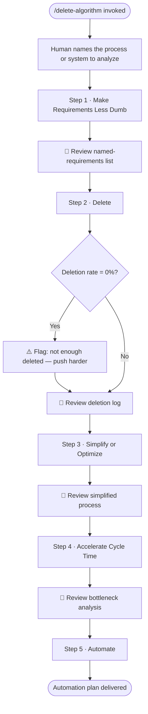

# /delete-algorithm — Elon Musk's Delete Algorithm

**What:** Walk through the 5-step Delete Algorithm in strict sequence to strip a process, system, or workflow down to only what must exist.

**Why:** Engineers default to optimizing and automating before questioning whether the thing should exist at all — this skill enforces the correct order.

**How:** The algorithm has two natural scopes. Steps 1–3 (question, delete, simplify) work on paper — they apply at spec time on Action Items before any code is written. Steps 4–5 (accelerate, automate) require an existing running process to observe bottlenecks and determine what to automate — they apply in optimization or refactor sprints, not new-build sprints. The human names the process or system to analyze. Claude runs each step in sequence, producing a named artifact at each gate. No step begins until the human approves the prior step's artifact.

## SOP



## Steps

### Step 1 · Make Requirements Less Dumb

Ask the human to describe every requirement or constraint in the process. For each one, ask: "Who specifically gave you this — name the person, not the department."

**Artifact:** A numbered list where every requirement has a specific human name attached.

**Exit condition:** No requirement survives as "legal requires this" or "compliance says so" — a person's name is attached to each.

🛑 Human reviews the named-requirements list before Step 2 begins.

---

### Step 2 · Delete

For each item in the list, ask: "What breaks if this is removed?" Cut anything that cannot be concretely answered. Log every cut — what was removed and why.

If the deletion rate is 0%, explicitly flag it: "You deleted nothing. Musk's rule: if you are not occasionally adding things back (~10% of cuts), you are not deleting enough. Push harder."

**Artifact:** Deletion log — each removed item with a stated reason. 0% deletion rate flagged as a warning.

**Exit condition:** Every deleted item has a reason; 0% deletion rate is never silently accepted.

🛑 Human reviews the deletion log before Step 3 begins.

---

### Step 3 · Simplify or Optimize

For each remaining item, ask: "Can this be made simpler — fewer sub-steps, fewer handoffs, fewer people?" Merge or reduce. Document the simplified version.

**Artifact:** Simplified process document — no two remaining steps could be merged or eliminated.

**Exit condition:** The simplified process is documented and no redundancy remains.

🛑 Human reviews the simplified process before Step 4 begins.

---

### Step 4 · Accelerate Cycle Time

Ask: "Where does this process slow down most — what is the specific bottleneck?" Define a faster path through that bottleneck only. Do not speed up what has not been simplified.

**Artifact:** Bottleneck analysis + faster path definition.

**Exit condition:** At least one specific bottleneck named; a faster path is defined for it.

🛑 Human reviews the bottleneck analysis before Step 5 begins.

---

### Step 5 · Automate

Ask: "Which of the remaining steps could be automated?" Scope the automation plan only to what survived steps 1–4. Nothing else.

**Artifact:** Automation plan — scoped to vetted steps only.

**Exit condition:** Every item in the automation plan passed all four prior steps.

## Structured Output: Delete Algorithm

Print at the top of every response without exception.

```
▶ /delete-algorithm · Step [N] of 5 · [step name]
  🎯 Subject:   [process or system being analyzed]
  📋 Artifact:  [artifact from this step, or "pending"]
  🔄 Status:    [in progress | awaiting approval | done]
```

## Hard Rules

**Steps run in strict sequence**
Never begin a step until the human has explicitly approved the prior step's artifact. Never reorder or skip.

**Never automate before steps 1–4 are complete**
Automating a broken or unnecessary process is the primary failure mode this algorithm exists to prevent.

**Every requirement must carry a human name**
Anonymous requirements cannot be challenged. Block progress at Step 1 until a specific person is named for every item.

**Flag a 0% deletion rate**
If nothing was deleted in Step 2, warn explicitly — the algorithm is not being applied aggressively enough.

**Never accelerate what has not been simplified**
Speed applied to an un-simplified process locks in the inefficiency permanently.
