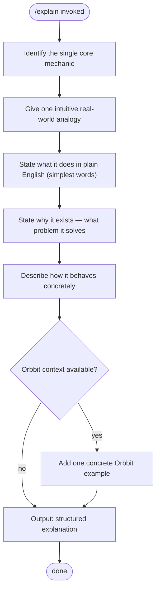

# /explain — Explain a Concept in Plain English

**What:** Turns a technical or complex concept into a plain-English explanation focused on what it does and why it exists.

**Why:** Without a structured approach, explanations drift into jargon or miss the core mechanic — leaving a false or incomplete mental model.

**How:** Identify the single core mechanic driving the concept. State what it does in plain English. Explain why it exists — what problem it solves. Describe how it behaves in concrete terms. If the concept appears in the Orbbit codebase or product domain, give one concrete example from there.

## SOP



## Structured Output: Explain

Print at the top of every response without exception:

```
▶ /explain · [concept name]
  ⚡ Mechanic:   [one-line core mechanic]
  🔄 Status:     [in progress | done]
```

## Hard Rules

**Never use jargon in the explanation itself**
Technical terms may be named once to orient the reader, but must be immediately followed by what they mean in plain English. The rest of the explanation must contain no unexplained jargon.

**Core mechanic first**
Always open with what the concept does and why it exists. Never lead with implementation details or history.

**Concrete behavior over abstract description**
Describe what actually happens — inputs, outputs, side effects — not what it "represents" or "models". Abstract descriptions without behavior leave the reader with nothing actionable.

**Lead with an intuitive analogy**
Always anchor the explanation with one real-world analogy that maps directly to the core mechanic — something the reader already understands from daily life. State explicitly what maps to what. Then follow with the precise technical behavior. The analogy makes the concept land; the behavior makes it accurate.

**Simplest words possible**
Prefer the shortest, most common word at every point. "Start" not "initiate". "Check" not "validate". "Store" not "persist". If a simpler word exists, use it.
