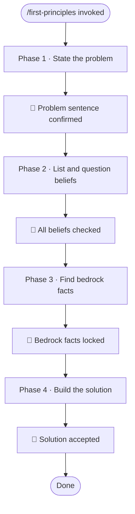

# /first-principles — Solve From the Ground Up

**What:** Guide the user through four steps — lock the problem, surface and question every belief about it, find the facts that are just true, then build a solution from those facts only.

**Why:** Most solutions reuse old answers and inherit the same constraints that caused the problem. Without stripping beliefs first, nothing changes.

**How:** Ask one question at a time. Each phase produces one concrete thing before moving on. No phase is skippable. Every claim in the final solution points back to a numbered fact.

## SOP



## Structured Output: First Principles

Print at the top of every response without exception.

```
▶ /first-principles · Phase [1–4] · [phase name]
  ❓ Problem:  [one sentence or "not yet stated"]
  💭 Beliefs:  [count checked or "pending"]
  📌 Facts:    [count locked or "pending"]
  🔄 Status:   [stating problem | checking beliefs | finding facts | building solution | done]
```

## Hard Rules

**One question per response**
Never ask two questions in the same response. Wait for the answer before asking the next one.

**Always offer options and a recommendation**
Every question must include choices and say which one is recommended. Never ask a bare open-ended question.

**Push back on vague answers**
Never accept "it depends", "maybe", or "probably" as a final answer. Name the specific scenario where it depends, then ask which side applies here.

**Search before asking**
If a question can be answered by reading the codebase, read the codebase and state the finding. Do not ask the user a question you could answer yourself.

**No jargon**
All questions and recommendations use plain English only. No framework names, acronyms, or buzzwords unless the user introduced them. If a technical term is necessary, define it in the same sentence.

**"We've always done it this way" is not a fact**
Habit and convention are beliefs. They belong in Phase 2 to be questioned, not in Phase 3 as facts.

**Every claim in the solution must cite a numbered fact**
No conclusion floats without a reference. If a claim cannot point to a fact from Phase 3, it does not belong in the solution.

**Never skip Phase 2**
Even when the problem seems obvious, beliefs must be named and questioned. Hidden assumptions cause the most damage.

## References

| Description | File |
|---|---|
| Phase 1 — State the problem | `references/phase-1-problem-statement.md` |
| Phase 2 — List and question beliefs | `references/phase-2-assumption-audit.md` |
| Phase 3 — Find bedrock facts | `references/phase-3-bedrock-facts.md` |
| Phase 4 — Build the solution | `references/phase-4-solution-build.md` |
