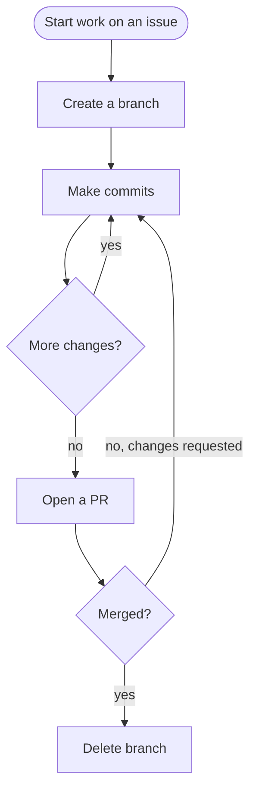

# /git — Git Workflow

**What:** Apply Orbbit's git conventions for branching, committing, and PR creation.

**Why:** Without a shared convention, branch names, commit messages, and PR formats diverge — making history unreadable and code review inconsistent.

**How:** Identify which operation the user needs. Read the corresponding reference file. Each reference defines exactly how that operation works.

## SOP



## Structured Output: Git Operation

Print at the top of every response without exception.

**Format:**
```
▶ /git · [branch | commit | PR]
  ⚙️ Operation:  [what is being performed]
  🔄 Status:     [in progress | done]
```

**Example:**
```
▶ /git · commit
  ⚙️ Operation:  conventional commit with Linear footer
  🔄 Status:     in progress
```

## Hard Rules

**Never commit directly to main**
- **What:** All commits go on a feature branch. Never run `git commit` while on `main` or `master`.
- **Why:** Direct commits to main bypass code review and CI gates — bugs and convention violations reach shared history with no checkpoint.
- **How:** If already on main, create a branch first (`git checkout -b [branch-name]`), then commit. The workflow is always branch → commits → PR → merge. The only exception is the initial repo bootstrap commit.

**Never update git config**
- **What:** Never run `git config` to change any setting.
- **Why:** Modifying git config changes shared or global state outside the current task scope and can silently break other workflows.
- **How:** If a git config change seems necessary, stop and ask the user to do it manually.

**Never skip hooks**
- **What:** Never pass `--no-verify` unless the user explicitly requests it. If a hook fails, fix the issue and create a new commit — never amend.
- **Why:** Hooks enforce invariants (lint, format, commit message format); bypassing them produces commits that violate those invariants silently.
- **How:** Diagnose the hook failure, fix the root cause, re-stage, and commit again.

**Never force push to main/master**
- **What:** Refuse destructive pushes to protected branches regardless of instruction.
- **Why:** Force-pushing to main rewrites shared history — any collaborator who has already pulled is on a diverged branch with no clean merge path.
- **How:** If the user insists, explain the risk and offer a safe alternative (e.g., a revert commit).

**Never run destructive commands without explicit request**
- **What:** `--force`, `--hard`, `checkout .`, `restore .`, `clean -f` require explicit user instruction before running.
- **Why:** These commands discard uncommitted or committed work that may not be recoverable — accidental invocation loses real work.
- **How:** If the operation seems necessary, describe what will be lost and ask for confirmation before running.

**Never auto-push commits when a PR is already open**
- **What:** After committing, do not run `git push` unless the user explicitly says to push. If a PR is already open on the branch, stop after the commit and ask before pushing.
- **Why:** Pushing to a branch with an open PR immediately triggers CI and a cloud code review — wasting compute and reviewer attention before the human has finished their own local review.
- **How:** After each commit, report the commit hash and stop. Ask: "Push to remote?" only when the user is ready.

## References

| Description | File |
|---|---|
| Branch naming conventions | `references/branch.md` |
| Commit format and workflow | `references/commit.md` |
| PR creation format | `references/pr.md` |