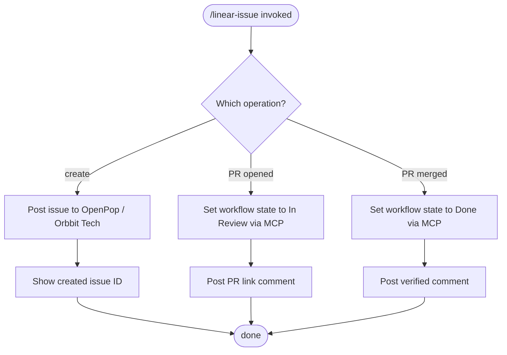

# /linear-issue — Linear Issue Operations

**What:** Execute a single Linear issue operation — create, mark In Review, or mark Done — via MCP.

**Why:** Without a defined contract, sprint steps would inconsistently structure issues or skip the verified comment, breaking the audit trail.

**How:** Infer the intended operation from context. Route to the correct operation block below. Execute it exactly as specified. Report the result in one line.

## SOP



## Structured Output: Linear Issue Operation

Print at the top of every response without exception.

**Format:**
```
▶ /linear-issue · [create | in-review | mark-done]
  🎫 Issue:      [ID and title, or "none"]
  🔄 Status:     [in progress | done]
```

**Example:**
```
▶ /linear-issue · create
  🎫 Issue:      none
  🔄 Status:     in progress
```

## Operation: Create Issue

Project: `OpenPop` · Team: `Orbbit Tech`

**Description format (what / why / how):**

```
**What:** [one sentence — what this issue delivers]

**Why:** [the business or engineering reason — why this work matters now]

**How:** [acceptance criteria — observable outcomes that confirm it's done]
```

**Required fields — set every one; never leave any blank:**

| Field | Rule |
|---|---|
| `title` | Names the outcome achieved (e.g. "Wire up CRE workflow"); must match the spec H1 exactly. The spec filename is derived from this title: `TECH-N-[title-slug].md` (lowercase, hyphenated). |
| `team` | `Orbbit Tech` |
| `description` | what / why / how format above |
| `priority` | Always set explicitly — default `Low` (4) if no stronger signal |
| `assignee` | Always set — use `"me"` unless the user specifies someone else |
| `labels` | At least one — choose from existing labels; ask user if unclear |
| `project` | Always `"OpenPop"` — pass the name string directly |
| `milestone` | Always `Submit hackathon project` — only one milestone exists. Pass the **ID** (see table below); never the name. |
| `estimate` | Ask the user; default `1` if not specified |
| `dueDate` | Default to today's date — human changes it if the issue cannot be done today |

**Milestone IDs — OpenPop:**

| Milestone | ID |
|---|---|
| Submit hackathon project | `5760f62a-1927-4abd-bcf4-7056bce469c1` |

Show the created issue ID before proceeding.

## Operation: In Review

Triggered when a PR is opened for this issue.

- Set the issue workflow state to `In Review` via Linear MCP
- Add comment: `PR opened: [url]`

## Operation: Mark Done

Triggered only after the PR is merged to `main` — never on PR open.

- Set the issue workflow state to `Done` via Linear MCP
- Add comment: `Verified. PR: [url]. Spec: [path]`

## Hard Rules

**Verify all required fields are set after create**
- **What:** After every `save_issue` create call, inspect the response and confirm these fields are present: `project`, `projectMilestone`, `assignee`, `labels`, `priority`, `estimate`, `dueDate`. If any is absent, patch it immediately with a follow-up `save_issue` call before proceeding.
- **Why:** Several fields fail silently — the API returns 200 but the value is never stored. Proceeding without verification leaves issues broken in Linear with no visible error.
- **How:** Parse the response object field by field against the checklist above. For any missing field, issue a `save_issue` patch with that field's value before moving to the next step.

**Never create an issue with missing required fields**
- **What:** Every issue must have `priority`, `assignee`, at least one `label`, `milestone`, and `project` set on creation — every row in the required fields table, no exceptions.
- **Why:** Unset fields make issues unsearchable and unowned — they rot in Backlog with no context.
- **How:** Check each required field against the table before calling `save_issue`. If a value is unclear, ask the user before proceeding.

**Never mark Done before the PR is merged**
- **What:** Done means the code is in `main`. Never set Done when the PR is merely opened or approved.
- **Why:** Marking Done on PR open closes the issue before the code lands.
- **How:** When a PR is opened, set state to `In Review`. Set state to `Done` only after the merge is confirmed.

**Never mark Done without the verified comment**
- **What:** The comment `Verified. PR: [url]. Spec: [path]` must be posted in the same operation as the status change.
- **Why:** Without the comment, there's no audit trail linking the closed issue to its PR and spec.
- **How:** Post the comment immediately after setting the state to Done; do not split them into separate steps.

**Always show issue ID after create**
- **What:** The created issue ID must appear in the response before any further action is taken.
- **Why:** The issue ID anchors all downstream references (commit footer, PR description, verified comment).
- **How:** After the create MCP call returns, extract the ID from the response and print it before doing anything else.
