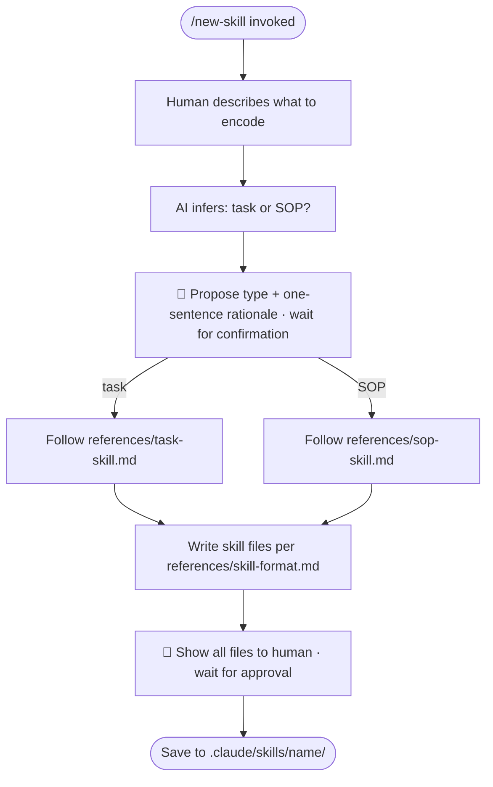

# /new-skill — Encode a Skill

**What:** Listen to what the human wants to encode, infer whether it is a task (single action, one output) or an SOP (multiple stages, gates between them), confirm once, then write the skill file.

**Why:** Task skills and SOP skills need different structures, but the human should not have to know the distinction before invoking. Forcing self-classification transfers cognitive work to the wrong party.

**How:** Infer the type from the description. Propose the classification with a one-sentence rationale. Get one confirmation. Route to the reference for that type and follow it step by step.

## SOP



## Structured Output: Skill Builder Status

Print at the top of every response without exception.

**Format:**
```
▶ /new-skill · [Task | SOP | unknown] · [current step]
  🏷️ Skill name: [name or "not yet named"]
  🔄 Status:     [inferring | confirmed | interviewing | writing | awaiting approval | done]
```

**Example:**
```
▶ /new-skill · SOP · interviewing
  🏷️ Skill name: deploy-check
  🔄 Status:     interviewing
```

## Hard Rules

**Infer first, confirm once**
- **What:** Classify as task or SOP yourself; propose it with a one-sentence rationale; accept one confirmation word; never re-ask.
- **Why:** Forcing the human to self-classify transfers cognitive work to the wrong party.
- **How:** Read the description, pick task or SOP, state "This looks like a [type] because [reason] — confirm?" then proceed on any affirmative.

**Never write before type is confirmed**
- **What:** Do not draft interview questions or write any file until the human has confirmed the skill type.
- **Why:** Writing output for the wrong type wastes review time and creates rework.
- **How:** Wait for explicit confirmation after the type proposal before moving to the intake step.

**One skill per invocation**
- **What:** Each invocation encodes exactly one skill.
- **Why:** Parallel encoding creates ambiguous state — it's unclear which skill the human is reviewing or approving at any moment.
- **How:** If the human describes two skills, finish the first through DONE, then start a fresh `/new-skill`.

**Follow the reference exactly**
- **What:** Use the reference files verbatim for intake questions and file structure; do not improvise.
- **Why:** Improvised structures diverge silently from the canonical format, producing skills the harness cannot parse reliably.
- **How:** Open the relevant reference before drafting anything and follow it step by step.

## References

|Description | File |
|---|---|
| Canonical skill file format | `references/skill-format.md` |
| Task skill procedure | `references/task-skill.md` |
| SOP skill procedure | `references/sop-skill.md` |
