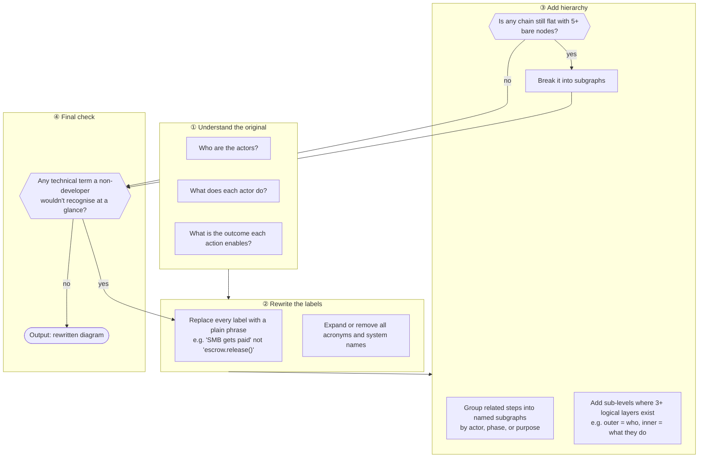

# /plain-diagram — Rewrite Diagrams in Plain English

**What:** Rewrites a mermaid diagram so a non-technical reader can extract the business story in one pass — plain English labels, clear hierarchy, no jargon.

**Why:** Diagrams built by developers default to system names and flat step-lists; stakeholders and judges can't see the business logic without mentally translating it first.

**How:** Identify every actor, action, and outcome in the original. Rewrite each node as a plain subject-verb-object phrase ("Walmart pays SMB", not "escrow.release()"). Group related steps into named subgraphs to create layers — never leave more than five nodes in a flat chain when they belong to the same actor or phase. Preserve the original logic exactly; replace only the language and structure.

## SOP



## Structured Output: Plain Diagram

Print at the top of every response without exception:

```
▶ /plain-diagram
  Source:  [file path or "pasted"]
  Status:  [reading | rewriting | done]
```

## Hard Rules

**Subject-verb-object labels only**
Every node label names a real-world action ("investor deposits USDC") — never a system call, variable name, or module name ("escrow.deposit()").

**Hierarchy required when multiple layers exist**
Any diagram with more than one logical level must use `subgraph` to express it. A flat chain of 5+ nodes that belong to the same actor or phase is always wrong.

**Replace, never annotate**
Rewrite the term outright. Do not add "(plain: X)", parenthetical explanations, or "formerly known as Y" beside the original.

**Preserve original logic exactly**
Do not add actors, steps, or relationships the source diagram did not contain. Change language and structure only.
