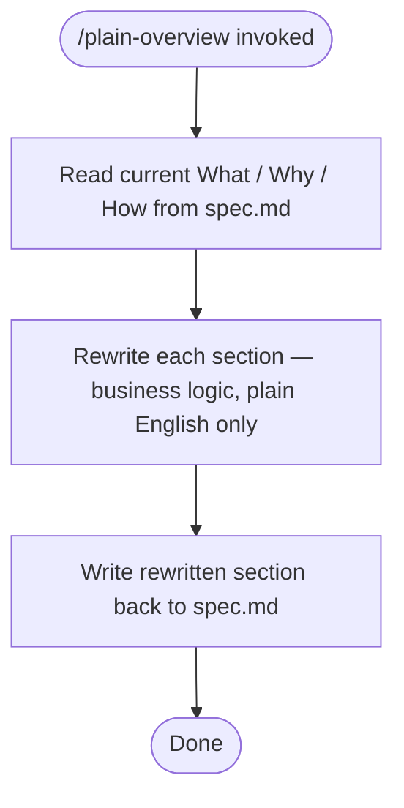

# /plain-overview — Rewrite Spec Overview in Plain English

**What:** Rewrite the What / Why / How section of the current spec.md in plain English that explains the feature in business terms.

**Why:** AI-generated overviews default to technical language — system mechanics, framework names, implementation details — which buries the business logic a stakeholder needs to evaluate the feature.

**How:** Read the existing What / Why / How from spec.md. Rewrite each section: What = what the feature does for the business in one sentence, Why = the business reason it exists and the problem it solves, How = the core process in plain terms without naming technologies, layers, or code structures. Write the rewritten section back to spec.md.

## SOP



## Structured Output: Plain Overview

Print at the top of every response without exception:

```
▶ /plain-overview · [current step]
  📄 Spec:    [spec.md path or "unknown"]
  🔄 Status:  [reading | rewriting | done]
```

## Hard Rules

**Plain English only**
Never use technical terms, framework names, system layer names, or implementation details in any of the three sections. If a technology name must appear, describe what it does in plain English instead.

**Business logic first**
Every sentence must answer a business question — what does this do for a user or the business, why does it matter, what process does it follow — not describe code or system structure.

**All three sections must be rewritten**
What, Why, and How must all be rewritten as a coherent block. Do not leave any section unchanged even if it seems acceptable.
