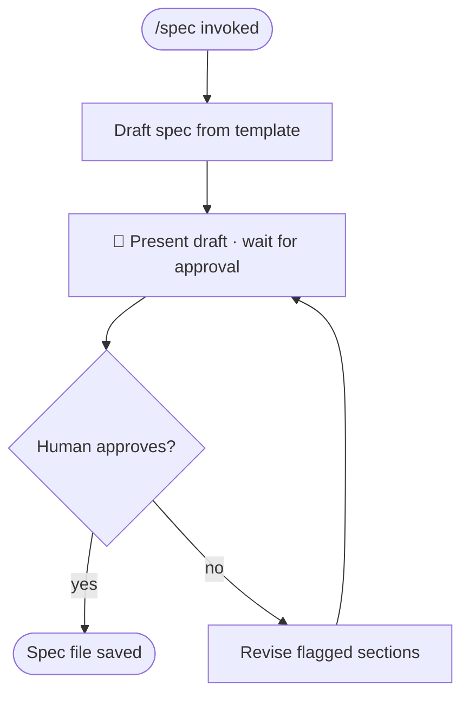

# /spec — Draft and Ratify a Sprint Spec

**What:** Draft a sprint spec at `specs/<project>/<milestone>/<layer>/<TECH-N-[linear-issue-title-slug]>/spec.md` — the planning contract that gates Phase 2 implementation. The folder slug is the Linear issue title, lowercased and hyphenated (e.g. "Set Up Local PostgreSQL" → `TECH-5-set-up-local-postgresql/spec.md`).

The `<layer>` must be exactly one of the seven implementation layers. Each spec lives in exactly one layer — the layer that owns the primary deliverable.

| Layer | Folder | What belongs here |
|---|---|---|
| Domain libs | `01-domain-libs` | Domain entities, services, repositories, business rules |
| Integration libs | `02-integration-libs` | Third-party clients, providers, external API wrappers |
| BFF | `03-bff` | API controllers, guards, modules, BFF logic |
| Webhook processors | `04-webhook-processors` | Inbound webhook handlers and event routing |
| Temporal | `05-temporal` | Workflows, activities, workers, schedules |
| FE UI | `06-fe-ui` | FE components, routes, state, client-side logic |
| E2E | `07-e2e` | Full system end-to-end test suites, global-setup, test infrastructure |

A spec that touches multiple layers belongs in the layer of its **primary deliverable** — the artifact that makes everything else verifiable. If the spec cannot be assigned to one layer without omitting a substantial independent deliverable, split it into separate specs before drafting.

**Why:** Unstructured design produces Zone 2 specs (cheap to generate, hard to verify); mandatory Core Logic + Action Items with deterministic verify clauses bounds verification to a binary pass/fail check per item.

**How:** After the grill session, draft the spec using the template below. Present the draft to the user. Iterate on flagged sections until the user explicitly approves all three: Zone 1 check, Core Logic diagram, and every Action Item. The spec is a permanent decision record — it is committed to the repo at Phase 3 close and never deleted.


## SOP



## Structured Output: Spec Builder Status

Print at the top of every response without exception.

**Format:**
```
▶ /spec · [drafting | reviewing | done]
  📄 File:    [path or "not yet named"]
  🔄 Status:  [drafting | awaiting approval | approved]
```

**Example:**
```
▶ /spec · reviewing
  📄 File:    specs/mvp-production-rewrite/m1-foundation/01-monorepo-tooling/TECH-2-initialize-monorepo/spec.md
  🔄 Status:  awaiting approval
```

## Hard Rules

**Zone 1 Check Names a Specific Stage**
- **What:** The Zone 1 check must identify which capital-cycle or execution stage this advances (Sourcing / Underwriting / Deployment / Recovery / Design / Test derivation / Implementation / Code review) and explain why it moves that stage toward Zone 1.
- **Why:** A vague claim ("this is Zone 1") cannot be verified — without a named stage and a reason, the check is unfalsifiable and provides no planning signal.
- **How:** Reject any Zone 1 check that doesn't name a stage. If the user can't articulate which stage, continue grilling before drafting.

**Core Logic Diagram Is Specific and Non-Placeholder**
- **What:** Every node is a noun or verb specific to this issue; edges are directional; forbidden paths are explicit via a `Never:` constraint or marked edge.
- **Why:** Generic labels ("process", "handle", "manage") produce a diagram that could describe any system — it conveys no intent and cannot be verified against the implementation.
- **How:** If the diagram cannot be drawn with specific nodes, the design is not ready. Block approval until it can.

**Every Verify Clause Is a Runnable Command**
- **What:** Each Action Item's Verify line is a pasteable shell command with a deterministic expected output — binary pass/fail, no "should" or "approximately".
- **Why:** A non-runnable verify clause cannot gate Phase 2 build — the test derivation step requires a verifiable acceptance criterion per item.
- **How:** If an item cannot be verified with one command, split it into smaller items until each one can.

**Action Items Describe What, Never How**
- **What:** Each `Implement:` line names the artifact to create or modify and its purpose in one sentence. It never lists imports, function signatures, variable names, parameter lists, or line-by-line instructions.
- **Why:** Listing every import and every line turns the spec into pseudocode — the implementer is no longer making decisions, they are transcribing. That is Zone 2: the spec is cheap to write but verification requires reading the whole implementation to check whether the pseudocode was followed correctly. The Core Logic section and diagram already capture design intent; the Action Item just names the file and what it contributes.
- **How:** If an `Implement:` line contains a code snippet, a function signature, an import path beyond the file being created, or more than two sub-bullets, strip it back to: file path + one-sentence purpose. Move any structural detail that is genuinely load-bearing into the Core Logic section instead.

**Overview Stays at Business Reasoning Level**
- **What:** The Overview's What/Why/How fields must describe the business outcome, the business need, and the strategic approach — not implementation details. No framework names, file paths, config patterns, package names, or schema shapes belong in the Overview.
- **Why:** Technical detail in the Overview conflates intent with implementation. Reviewers can no longer tell whether the right problem is being solved — they can only tell whether the chosen tools are being used correctly. That is Zone 2 verification.
- **How:** If a sentence in the Overview names a library, a file, a table, a config key, or a code pattern, move it to Core Logic or an Action Item. The Overview should be fully understandable by a non-engineer who knows the business.

**Write file first, print path only — never print contents in the terminal**
- **What:** Write the spec file to disk, then print one line: `Review: <absolute path>`. Never print spec content in the terminal.
- **Why:** The human reviews in VS Code, not the terminal. Printing content forces them to read in the wrong place and re-read when they open the file.
- **How:** Write file → print `Review: <absolute path>` → wait for approval or change requests. If changes are requested, edit the file and print the path again.

## Template

Draft the spec in plain English using this structure:

````markdown
# [Title]

## Overview

**What:**
[the business capability this delivers — what the business can do after this that it could not do before. No framework names, file paths, or technical terms.]

**Why:**
[the business problem or gap this closes — why the business is blocked or at risk without it. No implementation rationale.]

**How:**
[the strategic approach in one or two sentences — what the system will do at a business level, not which tools or patterns will be used to build it.]

**Zone 1 check:**
[which Zone 1 table this advances — capital-cycle (Sourcing / Underwriting / Deployment / Recovery) or execution (Design / Test derivation / Implementation / Code review) — and why it moves that stage toward Zone 1]

---

## Core Logic

```mermaid
[flowchart or stateDiagram — graspable in 30 seconds by someone who hasn't read the text]
```

- Always: [invariant that holds at every node in the diagram]
- Never:  [condition whose presence means the system is in an error state]

---

## File Tree

```
[directory tree of every file created or modified by this spec — one comment per line explaining its role]
```

---

## Action Items

**[ ] [title — one-line summary]**

Implement: [one sentence — file path + what it contributes. No imports, no function signatures, no parameter lists, no sub-bullets. e.g. "Create `apps/temporal/worker/src/workflows/invoice-factoring/invoice-factoring-recourse.workflow.ts` implementing `invoiceFactoringRecourseWorkflow` per the Core Logic diagram, and exporting the `submitRecourseOutcome` update definition."]

Verify:
```
[exact command to run]    ← pasteable as-is; e.g. `pnpm nx show projects`
```
→ [exact expected output] ← binary pass/fail; e.g. `exits 0, lists all declared projects`
````
