# /sprint — Complete One Issue to Zone 1

**What:** Run one full spec-ship cycle for a single issue — Design, Build, and Code Review — from stated human intent to Done in Linear.

**Why:** Zone 1 requires both cheap to build and cheap to verify. The three-phase structure bounds verification cost at each gate: design is verified against explicit acceptance criteria, tests are verified against spec items before any code is written, and code review is bounded to a checklist rather than a full read.

**How:** Three sequential phases with explicit entry and exit conditions. AI drives each phase autonomously; human approves at three discrete gates — spec, test logic, and diff. Never cross a gate without satisfying its condition.

## SOP

```mermaid
flowchart TD
    START(["/sprint invoked"])
    START --> READYCHECK

    subgraph PHASE1["Phase 1 · Design"]
        READYCHECK{"main · clean · synced with remote?"}
        HALT["🛑 STOP — fix git state first"]
        H1_WAIT["Human states intent"]
        NECESSITY["💬 First Principles · Necessity: does this need to be built? already exists? simpler alternative?"]
        H_COMMIT["🛑 WAIT — human confirms: yes, build this"]
        LINEAR["Create Linear issue via /linear-issue (all required fields: priority, assignee, labels, project, milestone ID, estimate, due date, cycle) → verify response → get TECH-N"]
        WORKTREE["pnpm worktree tech-n-slug · runs scripts/new-worktree.sh which creates the branch AND symlinks all .env.local files · directory name uppercase TECH-N, branch name lowercase tech-n"]
        GRILL["💬 First Principles · How: approach · constraints · verify criteria"]
        PRCHECK{"PR reviewable in ≤10 min?"}
        SPLIT["Split scope → grill each part"]
        DESIGN["Draft spec content: Core Logic + Action Items"]
        DELETE_STEPS["💬 Delete Algorithm · Steps 1–3 · prune Action Items"]
        H1_APPROVE["🛑 WAIT until human approves pruned spec"]
        WRITESPEC["Write spec.md into worktree directory"]
        READYCHECK -- "no" --> HALT
        READYCHECK -- "yes" --> H1_WAIT
        H1_WAIT --> NECESSITY --> H_COMMIT --> LINEAR --> WORKTREE --> GRILL --> PRCHECK
        PRCHECK -- "no" --> SPLIT --> GRILL
        PRCHECK -- "yes" --> DESIGN --> DELETE_STEPS --> H1_APPROVE --> WRITESPEC
    end


    WRITESPEC --> TESTS

    subgraph PHASE2["Phase 2 · Build — agent spawned in worktree directory"]
        TESTS["Derive Test Plan · write test.md"]
        LOGIC_CHECK{"Business logic to test?"}
        T_APPROVE["🛑 WAIT until human approves Test Plan"]
        T_APPROVED{Human approves?}
        T_REVISE["Revise test.md per feedback"]
        WRITE["Write tests — confirm all Red"]
        REDCHECK{Any new test passes?}
        FIX_TEST["Fix test — it asserts the wrong thing"]
        IMPL["Implement — make tests Green"]
        VERIFY["nx test + build + lint + typecheck"]
        GREENCHECK{All pass?}
        REFACTOR["Refactor — re-run after every change"]
        SPECCHECK{Every Action Item satisfied?}
        COMMIT["git commit (one or more) — based on git skill commit format"]
        TESTS --> LOGIC_CHECK
        LOGIC_CHECK -- "yes" --> T_APPROVE --> T_APPROVED
        LOGIC_CHECK -- "no — config/infra only" --> IMPL
        T_APPROVED -- "no" --> T_REVISE --> T_APPROVE
        T_APPROVED -- "yes" --> WRITE --> REDCHECK
        REDCHECK -- "yes" --> FIX_TEST --> WRITE
        REDCHECK -- "no — all red" --> IMPL --> VERIFY --> GREENCHECK
        GREENCHECK -- "no" --> IMPL
        MARKSPEC["Mark all Action Items [x] in spec.md"]
        GREENCHECK -- "yes" --> REFACTOR --> SPECCHECK
        SPECCHECK -- "gaps" --> IMPL
        SPECCHECK -- "all satisfied" --> MARKSPEC --> COMMIT
    end

    COMMIT --> SURFACE

    subgraph PHASE3["Phase 3 · Code Review"]
        SURFACE["Show diff --stat + Action Item → test table"]
        H3_APPROVE["🛑 WAIT until human approves or rejects diff"]
        PR["Open PR via git skill"]
        WAIT_CI["Wait for GitHub Actions Claude review to complete — gh pr checks --watch"]
        FETCH["Fetch automated review comments — gh pr view --comments"]
        TRIAGE["Reason through each comment: Fix or Dismiss with reason"]
        H3_TRIAGE["🛑 WAIT until human approves Fix/Dismiss plan"]
        FIXES["Implement approved fixes → commit"]
        POST_COMMENT["Post PR comment: Fix/Dismiss rationale for record"]
        SURFACE --> H3_APPROVE
        H3_APPROVE -- "no" --> IMPL
        H3_APPROVE -- "yes" --> PR --> WAIT_CI --> FETCH --> TRIAGE --> H3_TRIAGE
        H3_TRIAGE -- "changes needed" --> FIXES --> WAIT_CI
        H3_TRIAGE -- "approved" --> POST_COMMENT --> MERGE_GATE
    end

    MERGE_GATE["🛑 WAIT — human merges manually on GitHub — NEVER gh pr merge"]
    MERGE_GATE --> CLEANUP["git worktree remove · delete branch local + remote"]
    CLEANUP --> MAINFINAL["assert main session on main · git pull"]
    MAINFINAL --> DONE(["Mark Linear Done ✓"])
```


> `🛑` = discrete gate (one decision, then continue) · `💬` = active dialogue (sustained loop, resolves only when all targets are extracted)

---

## Structured Output: Sprint

Print at the top of every response without exception:

```
▶ /sprint · Phase [N] [Phase Name] · Step [X/Y] [Step Name]
  📁 Project:    [name | "unknown"]
  🏁 Milestone:  [name | "unknown"]
  🎫 Issue:      [TECH-N — title | "not yet created"]
  ⏱️ Estimate:   [N pt | "not set"]
  📅 Due:        [YYYY-MM-DD | "not set"]
  🌿 Branch:     [main | tech-n-slug | "not yet created"]
  📂 Worktree:   [none | TECH-N-slug]
  🔗 PR:         [URL | "not yet opened"]
  📝 Spec:       [not yet written | written | approved]
  🧪 Test Plan:  [not yet written | written | approved]
```

Examples:
```
▶ /sprint · Phase 1 Design · Step 2/5 Grill
  📁 Project:    MVP Production Rewrite
  🏁 Milestone:  M1 · Foundation
  🎫 Issue:      not yet created
  ⏱️ Estimate:   not set
  📅 Due:        not set
  🌿 Branch:     main
  📂 Worktree:   none
  🔗 PR:         not yet opened
  📝 Spec:       not yet written
  🧪 Test Plan:  not yet written

▶ /sprint · Phase 2 Build · Step 3/6 Write Tests
  📁 Project:    MVP Production Rewrite
  🏁 Milestone:  M1 · Foundation
  🎫 Issue:      TECH-12 — Set Up Entity ID Generator
  ⏱️ Estimate:   1 pt
  📅 Due:        2026-05-18
  🌿 Branch:     tech-12-set-up-entity-id-generator
  📂 Worktree:   TECH-12-set-up-entity-id-generator
  🔗 PR:         not yet opened
  📝 Spec:       approved
  🧪 Test Plan:  approved

▶ /sprint · Phase 3 Code Review · Step 2/4 Wait for CI
  📁 Project:    MVP Production Rewrite
  🏁 Milestone:  M1 · Foundation
  🎫 Issue:      TECH-12 — Set Up Entity ID Generator
  ⏱️ Estimate:   1 pt
  📅 Due:        2026-05-18
  🌿 Branch:     tech-12-set-up-entity-id-generator
  📂 Worktree:   TECH-12-set-up-entity-id-generator
  🔗 PR:         https://github.com/orbbit-tech/orbbit/pull/12
  📝 Spec:       approved
  🧪 Test Plan:  approved
```

---

## Hard Rules

**Read all referenced skills before Phase 1 begins**
- **What:** Before executing any Phase 1 step, read the full SKILL.md for every skill referenced in this sprint: `/linear-issue`, `/git`. Do not rely on memory or prior context — read the files.
- **Why:** Skills are the source of truth for their own contracts. Skipping a read means operating from a stale or incomplete mental model — missing required fields, wrong paths, wrong conventions. This is exactly how errors like missing `milestone`, wrong worktree paths, or wrong branch casing happen.
- **How:** At sprint start, read these files in order before any other action:
  1. `.claude/skills/linear-issue/SKILL.md`
  2. `.claude/skills/git/references/branch.md`
  3. `.claude/skills/git/references/commit.md`
  Then proceed with the SOP. Never skip this step, even if the sprint is a continuation.

---

**Necessity check output format**
- **What:** When presenting the necessity analysis (Grill topic 1), use a short paragraph + a one-line recommendation + a gate prompt. No table, no bullets.
- **Why:** The human needs one scan to decide, not a paragraph to parse.
- **How:** Always render exactly this structure, nothing more:

  One paragraph — plain English, 2–3 sentences max. State the core reason this needs to exist: what problem it solves, why no simpler alternative works, and any blocker. No headers, no bullets, no table.

  **Recommendation: YES — BUILD** (or **NO — SKIP** with one-line reason)

  🛑 Confirm to proceed

---

**Skip tests when there is no business logic**
- **What:** If every Action Item in the spec is a config file, shell command, or infra wiring step — with no functions, services, or data transformations to reason about — skip the test file entirely and go straight to implementation.
- **Why:** Wrapping shell verify commands in a test framework adds ceremony with no verification value. The spec's verify clauses are already the acceptance criteria; running them after implementation is the test.
- **How:** After deriving the Test Plan, check: does any Action Item involve a function, service, or data transformation? If no → skip `test.md`, skip Red phase, go directly to implementation. Use the spec's Verify clauses as the post-implementation acceptance checklist.

**Build agent file scope is strictly limited to what the spec requires**
- **What:** The build agent may only create or modify files whose paths are directly implied by the spec's Action Items. Every other file in the repo is read-only.
- **Why:** An agent that "cleans up" unrelated files, edits skill files, strips registrations, or modifies other sprints' work corrupts the repo and defeats Zone 1 verification — the diff no longer maps to one spec.
- **How:** Before writing any file, the agent must ask: "Is this file named or implied by a spec Action Item?" If no → do not touch it. This applies unconditionally to: `.claude/` skill files, other apps' source, other sprints' specs or tests, and any shared infrastructure not listed in the Action Items. Side-effect files (e.g. `app.module.ts` to register a new module) are allowed only when the Action Item explicitly requires them.

**Immutability After Phase 1**
- **What:** The spec is locked the moment the human approves it. The only permitted edit after approval is marking Action Items from `[ ]` to `[x]` once all their tests pass. No other changes.
- **Why:** A moving spec means tests and implementation are verified against a target that has already shifted — verification cost becomes unbounded.
- **How:** Anything discovered during Phase 2 that wasn't in the spec becomes a new issue, a new `.md`, a new sprint. Scope ceiling is enforced in Phase 1: if Action Items would produce a diff larger than ~300 lines or touch more than 5 files, split before ratifying.

**Branch and directory check — every agent, every phase transition**
- **What:** Every agent must verify it is on the correct branch in the correct directory before doing any work. Never assume — always check.
- **Why:** An agent that silently operates on the wrong branch corrupts another sprint's work. Two Phase 2 agents both in `/orbbit/` share the same `HEAD` and conflict immediately.
- **How:**
  - Phase 1 entry: assert `git branch --show-current` = `main` in the main session. Halt and instruct the user to `git checkout main` if not.
  - Phase 2 entry: build agent's first action is `cd` into `/Users/aphanmiz/Desktop/Orbbit/orbbit-codebase/orbbit-worktrees/TECH-N-slug/`, then assert `git branch --show-current` = `tech-n-slug`. Halt if either check fails. No file writes or git commands before this check passes.
  - Phase 3 after cleanup: main session asserts `git branch --show-current` = `main` and runs `git pull` to receive the merged commits. If the worktree directory still exists, run `git worktree remove` before proceeding.

**Phase Gates**
- **What:** Three hard checkpoints where no work in the next phase may begin until the prior condition is met.
- **Why:** Crossing a gate early collapses the zone boundary that makes each phase's output verifiable — implementation before tests means tests check code, not intent; a PR before human review means unreviewed code ships.
- **How:** Never write implementation before tests are derived from every Action Item. Never open a PR before the human approves in Phase 3. Never mark an issue Done before committing with the Linear issue ID in the footer.

**Phase 1 runs on main — no files until the worktree exists**
- **What:** Main must be clean and in sync with remote before any Phase 1 work begins.
- **Why:** Worktree branches from wherever local main points — dirty or stale main means the sprint starts from bad state, discovered only at merge time.
- **How:** On invocation: verify branch is main → verify working tree is clean → fetch and sync with remote → then proceed. Confirm necessity → invoke `/linear-issue` (all required fields) → run `pnpm worktree tech-n-slug` from the repo root (this calls `scripts/new-worktree.sh` which creates the branch AND symlinks all `.env.local` files into the worktree automatically — never use bare `git worktree add`) → grill topic 2 → write spec.md into the worktree → print path → wait for approval. Main session never leaves main.

**Spec, test plan, and code are colocated in the worktree**
- **What:** Every artifact produced in a sprint — spec, test plan, tests, and implementation — lives on the feature branch in the worktree. Nothing is committed to main during the sprint.
- **Why:** They are one logical unit. The PR tells the complete story: intent (spec), contract (test plan), verification (tests), delivery (code). Splitting them across branches breaks that story.
- **How:** Spec is written into the worktree at the end of Phase 1. Test plan, tests, and implementation are written in Phase 2. All commits go to the feature branch. The PR merges all of it to main at once.

**Work In Progress (WIP) Limit**
- **What:** One issue per worktree per branch; worktrees may run in parallel.
- **Why:** Isolating one issue per worktree keeps each diff unambiguous — it maps to exactly one spec. Parallel worktrees are safe as long as file footprints do not overlap; overlapping footprints are a scoping failure, not a merge problem.
- **How:** Create the worktree at the end of Phase 1 with `pnpm worktree tech-n-slug` from the repo root. The build agent works inside the worktree directory for all of Phase 2 and Phase 3. After the PR merges, run `git worktree remove` — the main session was on main the whole time, nothing to switch back to. One issue = one branch = one worktree — created together, destroyed after merge.

**Review Gates**
- **What:** At every 🛑 gate that produces a file (spec, test plan, diff), write the file first, then print only the absolute path. Never print file contents in the terminal.
- **Why:** The human reviews in VS Code — not in the terminal. Printing content forces them to read in the wrong place and re-read when they open the file.
- **How:** Write file → print one line: `Review: <absolute path>` → wait for approval or change requests. A 1–2 sentence summary of key decisions is allowed; nothing more.

**Continuity**
- **What:** The status line and resume prompt are printed every time, without exception.
- **Why:** An omitted status line is the first sign a sprint has drifted — the human loses their bearing and starts re-reading context instead of deciding.
- **How:** Never skip or abbreviate the status line. If interrupted mid-phase, resume by printing the status line and asking: "Shall we continue from here?"

---

## References

| Description | File |
|---|---|
| Phase 1 · Design | `references/phase-1-design.md` |
| Phase 2 · Build | `references/phase-2-build.md` |
| Phase 3 · Code Review | `references/phase-3-review.md` |
