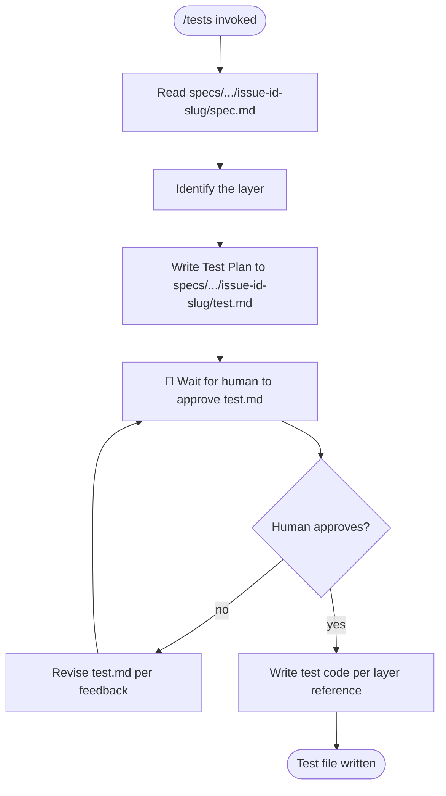

# /tests — Test Derivation from Spec

**What:** Read a spec file, load the reference for the layer being tested, derive a Test Plan, iterate on it until approved, then write test code.

**Why:** Tests written from the spec bind verification to stated intent — a written, iterable `test.md` lets the human refine coverage without reading TypeScript.

**How:** Read `spec.md` → identify the layer → load the layer reference → derive the Test Plan → write it to `test.md` (sibling of `spec.md`) → iterate until approved → write test code.

## SOP



## Structured Output: Test Status

Print at the top of every response without exception.

**Format:**
```
▶ /tests · [deriving | awaiting approval | writing | done]
  🏗️ Layer:   [layer name or "unknown"]
  📋 Plan:    [specs/.../issue-id-slug/test.md or "not yet determined"]
  📄 File:    [path/to/file.test.ts or "not yet determined"]
  🔄 Status:  [current status]
```

**Example:**
```
▶ /tests · awaiting approval
  🏗️ Layer:   BE unit
  📋 Plan:    specs/01-invoice-factoring/01-foundation/TECH-42-add-invoice-endpoint/test.md
  📄 File:    apps/bff/src/invoices/invoices.service.test.ts
  🔄 Status:  awaiting approval
```

## Hard Rules

**Never write code before the Test Plan is approved**
- **What:** Write `test.md` to the worktree first, print only the file path, wait for explicit human approval. Never print test plan contents in the terminal.
- **Why:** Writing code before the human confirms coverage makes the test suite a product of the implementation's logic rather than the spec's intent — tests become self-validating rather than independently verifying.
- **How:** Write `test.md` → print absolute path → stop. Do not write any test code until the human explicitly approves.

**One test per testable statement**
- **What:** Each test maps to exactly one named spec item (Action Item or Core Logic constraint). Do not group multiple assertions under one test name, and do not invent tests not traceable to the spec.
- **Why:** Grouping assertions hides which spec item fails; inventing tests adds coverage for behavior no one agreed on and creates maintenance burden with no spec anchor.
- **How:** For each Action Item Verify clause and each Core Logic Always/Never constraint, write exactly one test. Stop there.

**Follow the layer reference exactly**
- **What:** File location, import style, describe/it structure, assertion library — all come from the layer reference. Do not improvise.
- **Why:** Improvised structure produces tests that pass locally but don't integrate with the test runner or CI config — the layer reference encodes those constraints.
- **How:** Open the layer reference before writing any code and follow it line by line.
