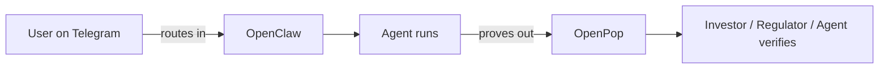
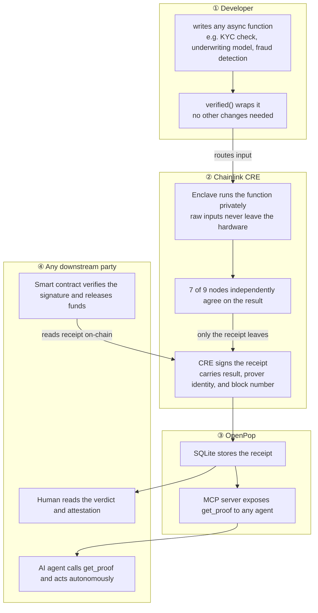
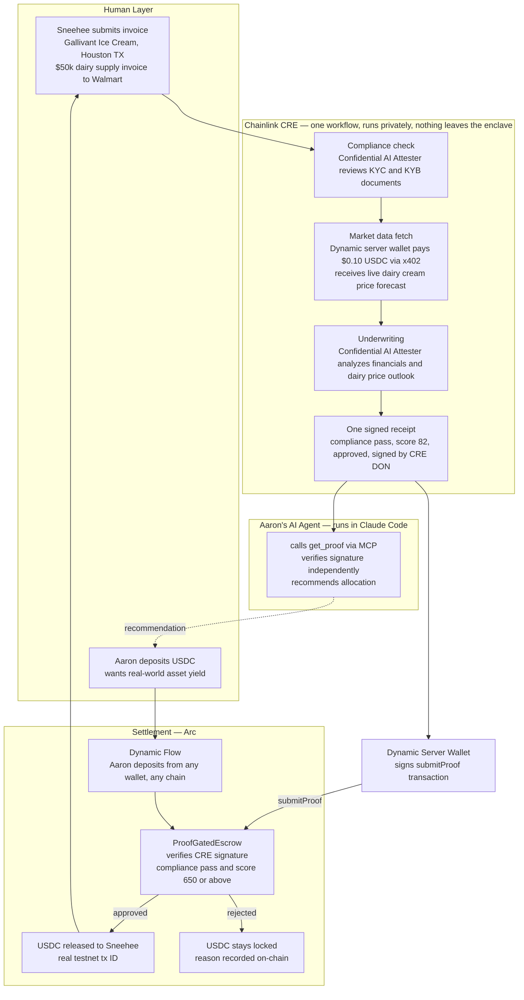

# OpenPop: Proof-Gated Invoice Factoring Demo

## What

**One liner:** OpenPop is the OpenClaw of verifiable agent workflows. Proof over Promises.

**What it does:** A framework that makes any trust-critical workflow verifiable by downstream agents — without trusting the operator. Wrap your functions, get a signed receipt, expose it via MCP. Any downstream agent can verify and continue. No human in the middle.

**Scope:** For workflows with private inputs and a counterparty who needs to trust the output.

### Analogy

OpenClaw routes work *into* agents. OpenPop proves what those agents *produced*.

| | OpenClaw | OpenPop |
|---|---|---|
| **Framework layer** | Wire up skills, channels, agents | Wire up verified(), receipt store |
| **Application you run** | Gateway UI + assistant | Receipt UI + MCP server |
| **Who builds with it** | Developers wire up agent skills | Developers wrap trust-critical functions |
| **Who consumes it** | End-users chat across channels | Counterparties (investors, regulators, agents) verify receipts |
| **Which side of the pipeline** | Input — routes messages into agents | Output — proves what agents produced |

They are complementary pieces of the same agent stack:

### Demo Deliverable

**One liner:** Aaron knows every deal was properly screened — no gut feeling, no blind trust, no Sneehee's private data ever exposed.

**The story:** Sneehee runs Gallivant Ice Cream in Houston, TX — she sells to Walmart and Kroger. Dairy is 40% of her cost of goods. She submitted a $50k invoice and needs working capital while Walmart pays. Aaron is an investor who wants real-world asset yield. He deposits USDC into escrow. OpenPop runs compliance and underwriting privately inside a hardware-secured enclave — including live dairy cream price forecasts fetched via x402 — and produces signed receipts. The Arc contract verifies both receipts and releases USDC to Sneehee automatically. Aaron never had to trust Orbbit's word. Aaron's AI agent calls get_proof via MCP, verifies the signatures, and confirms every check passed — without asking anyone.

---

## Why

**Motivation:** Built from a real problem we encountered building Orbbit — an invoice factoring platform where investors had to trust the operator's word that compliance and underwriting were done correctly. That trust is a promise, not a proof. It limits our liquidity capacity.

**The broader problem:** Every trust-critical AI workflow — compliance, finance, legal, healthcare etc — runs invisibly on private servers. Downstream parties can't verify the result. They just implicitly trust the operator.

**Why now:** AI agents are taking over business execution. The bottleneck shifts from execution cost to verification cost. Agents can't trust each other — they get stuck waiting for a human to manually verify and pass results along. That friction is the new economic bottleneck. OpenPop closes it: upstream workflow runs, proof produced, downstream agent reads via MCP and continues automatically.

**Status quo / existing attempts:** ERC-8004 is the Ethereum standard for agent trust — Identity (who the agent is), Reputation (track record), and Validation (proof a task was done correctly). Identity and Reputation are live and working. Validation is broken — it's a form anyone can fill in. Any agent can post "I ran the compliance check, score: 99" with no cryptographic proof. It's like LinkedIn letting you write your own certifications with no verifications. OpenPop fills that gap — a signed receipt from an independent hardware network that nobody, not the operator, not the developer, can fake. The standard defined the problem. We built the missing piece.

---

## How

**Mechanism:** Wrap any function with verified(). It routes through Chainlink CRE — a decentralized network that runs computation inside a hardware-secured enclave, reaches consensus, and produces a signed receipt. Downstream agents call get_proof via MCP and trust the result without trusting the operator.

**What the developer writes:** business logic only — the functions, the privacy declaration, the data sources. OpenPop handles the TEE routing, receipt schema, MCP server, and observer UI.

---

## How OpenPop Works

- **Privacy moat:** raw inputs stay inside the TEE permanently — no operator, developer, or node can extract them
- **Trust guarantee:** both receipts must come from multi-node CRE consensus — a single signer is rejected
- **Framework, not a service:** verified() runs in your stack — you own the function, OpenPop owns the plumbing

---

## Demo Logic

- **Privacy moat:** Sneehee's KYC docs, financials, and credit history stay inside the enclave permanently. Orbbit's underwriting logic is never exposed.
- **What leaves the enclave:** one signed receipt — compliance result, credit score, decision, signature, consensus proof. Enough to verify, nothing more.
- **Market data:** live dairy cream price forecast fetched from the Orbbit dairy API via x402 — Dynamic server wallet pays $0.10 USDC per call inside the enclave.
- **Aaron's agent:** runs in Claude Code, calls get_proof via MCP, verifies the signature, recommends allocation. No raw data needed.
- **Settlement rule:** no USDC moves without the receipt signed by CRE multi-node consensus. A single signer is rejected.

**The investor pitch in one sentence:** the capital was never at the mercy of our word — the contract held it, the proof unlocked it, and Aaron can verify both right now.

---

## UI Layout

The proof receipt page serves two audiences simultaneously: a human who needs to trust the decision, and an AI agent that needs to consume the signed receipt programmatically. Both read the same underlying data — only the representation changes.

### Mechanism: side sheet

A persistent "For Agents" button in the nav slides open a right-side panel. The human view stays fully visible on the left; the panel overlays the right ~40% of the screen. A second click (or Escape) closes it.

A toggle was considered but rejected — it hides one view entirely, which weakens the demo moment. The whole point is showing both audiences exist at once.

### Human view (left)

Shows Sneehee's verdict — decision badge, credit score, and confidence level. A 4-step workflow stepper shows each stage: Invoice Submitted, Financial Analysis, Market Data Oracle, Decision Recorded. Below that, the prover identity, consensus ratio, block number, and transaction hash.

### Agent view (right — side sheet)

Shows the raw signed receipt JSON exactly as returned by Chainlink CRE — decision, score, signature, prover, consensus, block. Below that, a one-liner MCP install snippet showing that any agent can call get_proof without trusting the platform.

The demo moment: both panels open at the same time. Sneehee sees her approval. Aaron's AI agent reads the same proof. Neither had to trust Orbbit.

---

## Tech Stack

### Sponsor tech — new for this hackathon

| Layer | Technology | What it does here |
|---|---|---|
| **Chainlink CRE** | Confidential Runtime Execution | Runs verification workflows on a decentralized node network; produces signed receipts |
| **Chainlink Confidential AI Attester** | TEE-based LLM inference | Runs KYC/KYB and credit scoring inside a hardware-secured enclave; outputs cryptographically attested results |
| **Arc** | EVM testnet + Circle stablecoin tooling | Core loan enforcement — holds investor USDC in escrow, verifies CRE receipts, auto-releases to Sneehee on approval |
| **Arc x402** | Nanopayment protocol | Dynamic server wallet pays per-query for live dairy cream price data before underwriting runs |
| **Dynamic** | Server Wallet (Node SDK) | Agent-controlled wallet that signs the submitProof transaction and x402 payment — no human in the loop |
| **Dynamic** | Flow | Pulls USDC from Aaron's wallet on any chain into Arc escrow |

### Carried from Orbbit codebase

| Layer | Technology | What it does here |
|---|---|---|
| **Dairy cream price API** | FastAPI on AWS Lambda (already deployed) | Live USDA cream price data, ARIMA forecast, Monte Carlo simulation — paid via x402 |
| **Language** | TypeScript | OpenPop framework, demo runner, and demo UI |
| **State** | SQLite | Stores workflow step status and signed receipts so the UI can poll live progress |
| **Smart contracts** | Solidity | ProofGatedEscrow — holds USDC, verifies CRE signatures, releases on proof |
| **Frontend** | Next.js | Demo dashboard for Aaron (investor) and Sneehee (business) |

---

## What is Mocked vs Real

| Component | Status | Why |
|---|---|---|
| Invoice (Gallivant Ice Cream, $50k dairy supply to Walmart) | **Mocked** | Real KYC/KYB API onboarding takes weeks |
| Sneehee's identity documents (SSN, EIN) | **Mocked** | No real PII in a public demo |
| Sneehee's bank statements | **Mocked** | Generated realistic shape |
| Credit score threshold logic | **Mocked** | Score 650 or above = approve; hardcoded for demo |
| CRE workflow execution | **REAL** | Simulated via CRE CLI; Chainlink team deploys to live CRE DON |
| Confidential AI Attester | **REAL** | Hits Chainlink sandbox API with real inference request |
| Dairy cream price forecast | **REAL** | Live data from Orbbit dairy API, paid via x402 USDC |
| Cryptographic receipt | **REAL** | Real signature from CRE multi-node consensus |
| Arc smart contract | **REAL** | Deployed on Arc testnet; real conditional USDC logic |
| USDC release transaction | **REAL** | Real testnet tx ID, verifiable by judges |
| Dynamic Flow investor deposit | **REAL** | Aaron deposits real USDC via Dynamic Flow |
| Chainlink Price Feed (USDC/USD) | **REAL** | Called inside Arc contract during proof submission |
| Dynamic server wallet | **REAL** | Signs the submitProof call and x402 payment |

---

## Agent Use Case: Any Counterparty That Needs to Verify

The Sneehee / Gallivant Ice Cream demo is one instance. The framework works for any workflow where a downstream party — investor, regulator, auditor, another agent — needs to verify that a task was done correctly without trusting the operator.

| Domain | Workflow | What the agent verifies |
|---|---|---|
| Lending | KYC + underwriting before capital release | Compliance passed, score threshold met, data sources used |
| Insurance | Risk assessment before policy issuance | Actuary model ran on correct inputs, privacy boundary respected |
| Payments | Fraud check before large transfer | Fraud model ran in TEE, not bypassed |
| Legal | Document review before contract execution | Review workflow completed, policy rules followed |
| Supply chain | Supplier audit before purchase order | Audit ran against correct data, result not tampered |

---

## Presentation Breakdown — 4 Minutes

| Section | Slide | Time | What to say |
|---|---|---|---|
| **Problem** | Trust-Critical AI Workflows Are Painful to Build | 0:00 – 0:35 | Normal AI just needs to do the task. Trust-critical AI needs to prove the task was done right — without exposing private data. Three unsolved dimensions: what facts did the agent use, what must stay private, what rules must be followed. Every developer building compliance, credit, fraud, or legal workflows rebuilds this plumbing from scratch. |
| **Solution** | verified() + Chainlink CRE = Proof over Promises | 0:35 – 1:05 | Chainlink CRE is the machine that never lies — runs computation inside a hardware-secured enclave, reaches multi-node consensus, produces a signed receipt. OpenPop is the wrapper that connects your code to it: wrap any function with verified(), get a signed receipt. Humans rely on promises. Agents only understand proofs. |
| **Demo** | For Humans / For Agents | 1:05 – 2:35 | Sneehee submits her invoice — watch the workflow — dairy price forecast fetched via x402 — receipts land on-chain — USDC auto-releases to Sneehee. Then flip to agent view: Aaron's Claude agent calls get_proof, verifies the signature, confirms every check passed — without asking us anything. Two audiences, one proof, zero trust in the operator. |
| **Why use it** | Developers should not spend weeks rebuilding trust plumbing | 2:35 – 3:05 | Ship faster. Protect private data. Build for humans and agents. Make workflows counterparty-ready. One function wrapper, any async function, any domain. More business activity can move into agentic commerce. |
| **Why it matters** | The Cost to Verify is the New Economic Bottleneck | 3:05 – 4:00 | The cost to automate collapsed. AI runs compliance, underwriting, fraud detection for cents. But the cost to verify what the AI did has not collapsed — it is still trust-the-operator. That gap is Zone 2: cheap to automate, impossible to verify. OpenPop moves workflows from Zone 2 to Zone 1 — cheap to automate AND cheap to verify. That is the infrastructure layer the agentic economy needs. ERC-8004 defines the standard for agent validation on-chain — today anyone can self-certify a result, like writing your own LinkedIn certification. OpenPop is the first working implementation that makes those certifications issuer-verified: Chainlink's independent node network signs the receipt, not the operator. |
