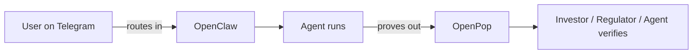
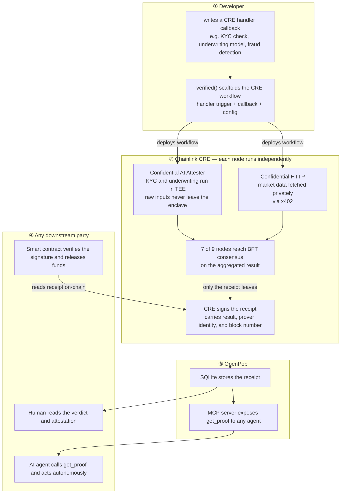
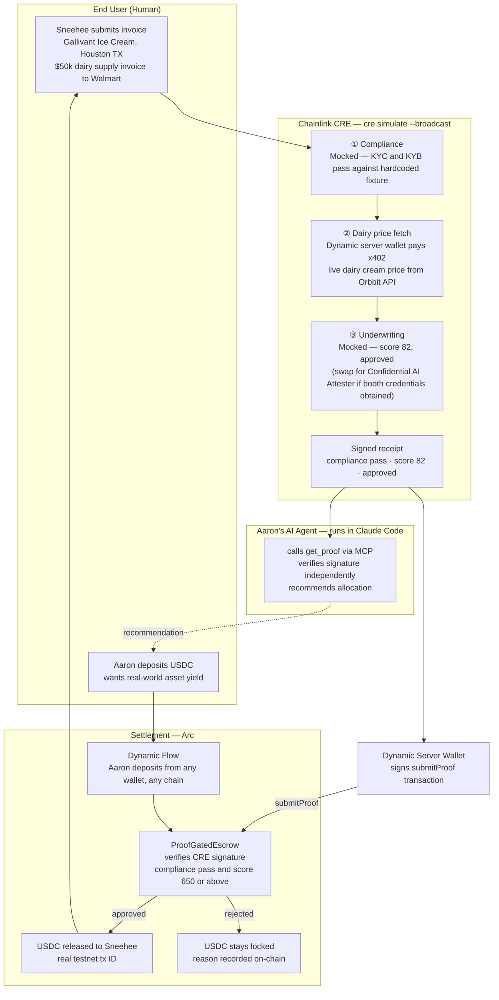

# OpenPop: Proof-Gated Invoice Factoring Demo

## What

**One liner:** OpenPop is the OpenClaw of verifiable agent workflows. Proof over Promises.

**What it does:** A framework that makes any trust-critical workflow verifiable by downstream agents — without trusting the operator. Wrap your functions, get a signed receipt, expose it via MCP. Any downstream agent can verify and continue. No human in the middle.

**Scope:** For workflows with private inputs and a counterparty who needs to trust the output.

### Analogy

OpenClaw routes work *into* agents. OpenPop proves what those agents *produced*.

| | OpenClaw | OpenPop |
|---|---|---|
| **Framework layer** | Wire up skills, channels, agents | Wire up verified(), receipt store |
| **Application you run** | Gateway UI + assistant | Receipt UI + MCP server |
| **Who builds with it** | Developers wire up agent skills | Developers wrap trust-critical functions |
| **Who consumes it** | End-users chat across channels | Counterparties (investors, regulators, agents) verify receipts |
| **Which side of the pipeline** | Input — routes messages into agents | Output — proves what agents produced |

They are complementary pieces of the same agent stack:

### Demo Deliverable

**One liner:** Aaron knows every deal was properly screened — no gut feeling, no blind trust, no Sneehee's private data ever exposed.

**The story:** Sneehee runs Gallivant Ice Cream in Houston, TX — she sells to Walmart and Kroger. Dairy is 40% of her cost of goods. She submitted a $50k invoice and needs working capital while Walmart pays. Aaron is an investor who wants real-world asset yield. He deposits USDC into escrow. OpenPop runs compliance and underwriting privately inside a hardware-secured enclave — including live dairy cream price forecasts fetched via x402 — and produces signed receipts. The Arc contract verifies both receipts and releases USDC to Sneehee automatically. Aaron never had to trust Orbbit's word. Aaron's AI agent calls get_proof via MCP, verifies the signatures, and confirms every check passed — without asking anyone.

---

## Why

**Motivation:** Built from a real problem we encountered building Orbbit — an invoice factoring platform where investors had to trust the operator's word that compliance and underwriting were done correctly. That trust is a promise, not a proof. It limits our liquidity capacity.

**The broader problem:** Every trust-critical AI workflow — compliance, finance, legal, healthcare etc — runs invisibly on private servers. Downstream parties can't verify the result. They just implicitly trust the operator.

**Why now:** AI agents are taking over business execution. The bottleneck shifts from execution cost to verification cost. Agents can't trust each other — they get stuck waiting for a human to manually verify and pass results along. That friction is the new economic bottleneck. OpenPop closes it: upstream workflow runs, proof produced, downstream agent reads via MCP and continues automatically.

**Status quo / existing attempts:** ERC-8004 is the Ethereum standard for agent trust — Identity (who the agent is), Reputation (track record), and Validation (proof a task was done correctly). Identity and Reputation are live and working. Validation is broken — it's a form anyone can fill in. Any agent can post "I ran the compliance check, score: 99" with no cryptographic proof. It's like LinkedIn letting you write your own certifications with no verifications. OpenPop fills that gap — a signed receipt from an independent hardware network that nobody, not the operator, not the developer, can fake. The standard defined the problem. We built the missing piece.

---

## How

**Mechanism:** The developer writes a CRE workflow — a `handler(trigger, callback)` function in TypeScript. Inside that handler, privacy-sensitive steps use two specific Chainlink capabilities: Confidential AI Attester (TEE-based LLM inference for KYC/underwriting, inputs never leave the enclave) and Confidential HTTP (for fetching market data privately). Each CRE node runs the workflow independently; 7 of 9 must reach BFT consensus before the report is signed. OpenPop's `verified()` is an abstraction we build that scaffolds and deploys this CRE workflow, stores the signed receipt, and exposes it via MCP. Downstream agents call `get_proof` and trust the result without trusting the operator.

**What the developer writes:** the handler callback (business logic), `config.json` (thresholds, API URLs), and `secrets.yaml` (references to API keys). OpenPop handles the CRE workflow scaffolding, receipt storage, MCP server, and observer UI.

---

## How OpenPop Works

- **Privacy moat:** raw inputs to Confidential AI Attester stay inside the TEE permanently — no operator, developer, or node can extract them
- **Trust guarantee:** the receipt must come from BFT consensus (7 of 9 nodes) — a single signer is rejected
- **Framework, not a service:** verified() runs in your stack — you own the handler, OpenPop owns the plumbing

---

## Demo Logic

**The investor pitch in one sentence:** the capital was never at the mercy of our word — the contract held it, the proof unlocked it, and Aaron can verify both right now.

---

## Tech Stack

### Sponsor tech — new for this hackathon

| Layer | Technology | What it does here | Priority |
|---|---|---|---|
| **Chainlink CRE** | Confidential Runtime Execution | Runs the 3-step verification workflow locally via `cre simulate --broadcast`; produces signed receipt | **L0 — must ship** |
| **Arc** | EVM testnet + USDC escrow | `ProofGatedEscrow` holds USDC, verifies receipt, auto-releases to Sneehee | **L0 — must ship** |
| **Arc x402** | Nanopayment protocol | Dynamic server wallet pays per-query for live dairy cream price | **L0 — must ship** |
| **Dynamic** | Server Wallet (Node SDK) | Signs the `submitProof` tx and x402 payment — no human in the loop | **L0 — must ship** |
| **Dynamic** | Flow | Aaron deposits USDC from any wallet/chain into Arc escrow | **L1 — add if time** |
| **Chainlink Confidential AI Attester** | TEE-based LLM inference | Swap mocked underwriting for real AI call — one-line change | **L2 — only if booth credentials obtained** |

### Carried from Orbbit codebase

| Layer | Technology | What it does here |
|---|---|---|
| **Dairy cream price API** | FastAPI on AWS Lambda (already deployed) | Live USDA cream price data — paid via x402 |
| **Language** | TypeScript | CRE workflow, MCP server, Next.js app |
| **State** | `proof.json` flat file | Written by CRE runner, read by MCP server and Next.js API routes |
| **Smart contracts** | Solidity | `ProofGatedEscrow` — holds USDC, verifies CRE signature, releases on proof |
| **Frontend** | Next.js | OpenPop studio (pipeline + receipt) · investor panel (deposit + agent verdict) |

---

## Build Layers

Ship in strict order. Do not start L1 until L0 is working end-to-end.

### How CRE runs in this demo

`cre workflow simulate --broadcast`:
- Workflow runs **locally** via CRE CLI
- `--broadcast` deploys `MockKeystoneForwarder` on Arc testnet — accepts locally-signed receipts
- `ProofGatedEscrow` points at `MockKeystoneForwarder`
- Receipt submitted on-chain → USDC releases → **real Arc testnet tx ID, verifiable by judges**

Upgrade path: swap `MockKeystoneForwarder` → real `KeystoneForwarder` if Chainlink grants Early Access. Nothing else changes.

---

### L0 — Minimum viable (ship this first, demo is done when this works)

**Goal:** one working end-to-end run locally, proof.json written, Arc tx on-chain, MCP readable. Video recorded. Public Next.js URL showing pre-computed results.

| Component | What | Status |
|---|---|---|
| CRE workflow | 3-step TypeScript handler: compliance → x402 fetch → underwriting | All 3 steps mocked except x402 HTTP call |
| `cre simulate --broadcast` | Runs workflow, submits receipt to Arc via MockKeystoneForwarder | Real Arc testnet tx |
| `proof.json` | Written by CRE runner, contains result + simulated signature + Arc tx hash | Flat file, no DB |
| `ProofGatedEscrow.sol` | Deployed on Arc testnet, verifies receipt, releases USDC | Real on-chain |
| Dynamic Server Wallet | Signs `submitProof` tx + x402 payment | Real |
| x402 dairy price fetch | Live call to Orbbit dairy API, paid via server wallet | Real |
| MCP server | `get_proof` tool reads `proof.json`, returns it | Deployed alongside Next.js |
| Aaron's agent | Claude Code connected to MCP, calls `get_proof`, verifies, returns verdict | Claude Code + MCP |
| Next.js UI | OpenPop studio: 3 pipeline steps + receipt JSON + Arc tx link + agent verdict panel | Pre-computed data, static render |
| Aaron pre-funded | USDC already in escrow before demo runs | Done manually once |

**Wins with L0:** Chainlink CRE PRIMARY · Arc PRIMARY · Dynamic PRIMARY (server wallet)

---

### L1 — Add if L0 is done and time remains

| Component | What | Adds |
|---|---|---|
| Dynamic Flow | Aaron's investor panel with Flow widget — deposit from any wallet/chain | Dynamic SECONDARY (Best Use of Flow, $3k) |
| Deployed MCP server | Judges can connect their own Claude Code to `get_proof` | Stronger judge interaction |
| Animated pipeline UI | Steps animate in sequence as CRE runs, not static render | Better demo video |

---

### L2 — Only if Chainlink booth credentials obtained

| Component | What | Adds |
|---|---|---|
| Confidential AI Attester | Swap mocked underwriting step for real Confidential HTTP call to LLM | Chainlink SECONDARY (Confidential AI Attester, $2k) |
| Firmographic check | Two independent AI calls on Gallivant Ice Cream public signals; both must agree | Stronger compliance story |

---

## Agent Use Case: High-Stakes, Multi-Party Workflows With External Dependencies

The Sneehee / Gallivant Ice Cream demo is one instance of a recurring structural problem: **Party A runs a workflow. Party B cannot act until they trust Party A's output. Today that trust is a manual bottleneck — an email, a PDF, a phone call.** OpenPop removes the bottleneck. Party A's workflow produces a signed receipt. Party B's agent reads it via MCP, verifies it independently, and triggers their downstream work automatically — no human relay, no blind trust.

This pattern applies across any industry where one party's verified output is a prerequisite for another party's action:

| Industry | Party A's Workflow | Why Party B Is Blocked Without Proof | Party B's Downstream Action Unlocked |
|---|---|---|---|
| **Finance — Lending** | KYC + credit underwriting on a borrower | Investor / lender won't release capital without knowing compliance ran on real data and the score threshold was actually met | Capital release, loan origination, USDC disbursement |
| **Finance — Insurance** | Actuarial risk assessment on a policy applicant | Underwriter won't bind coverage without proof the risk model ran on the correct inputs and wasn't manipulated | Policy issuance, premium setting, coverage binding |
| **Legal** | Contract review against a compliance rulebook | Counterparty won't execute or sign without proof the review ran, which rules were applied, and no clauses were skipped | Contract execution, digital signature, escrow release |
| **Healthcare** | Clinical trial eligibility screening on a patient record | Sponsor / CRO won't enroll the patient without proof the inclusion/exclusion criteria ran on real EHR data inside a privacy boundary — not self-reported by the site | Patient enrollment, trial activation, IRB reporting |
| **Supply chain** | Supplier audit against ESG or quality standards | Buyer won't issue a purchase order without proof the audit ran against the correct supplier data and wasn't self-reported | PO issuance, onboarding approval, payment terms unlock |
| **Real estate** | Title search and lien check before closing | Escrow agent won't release funds without proof the title check ran on the correct property records | Escrow release, deed transfer, mortgage funding |

The common structure in every row: **the downstream party has a hard dependency on the upstream workflow — not on the operator's word that it ran, but on cryptographic proof that it ran correctly.** OpenPop is the layer that converts that word into a proof.

