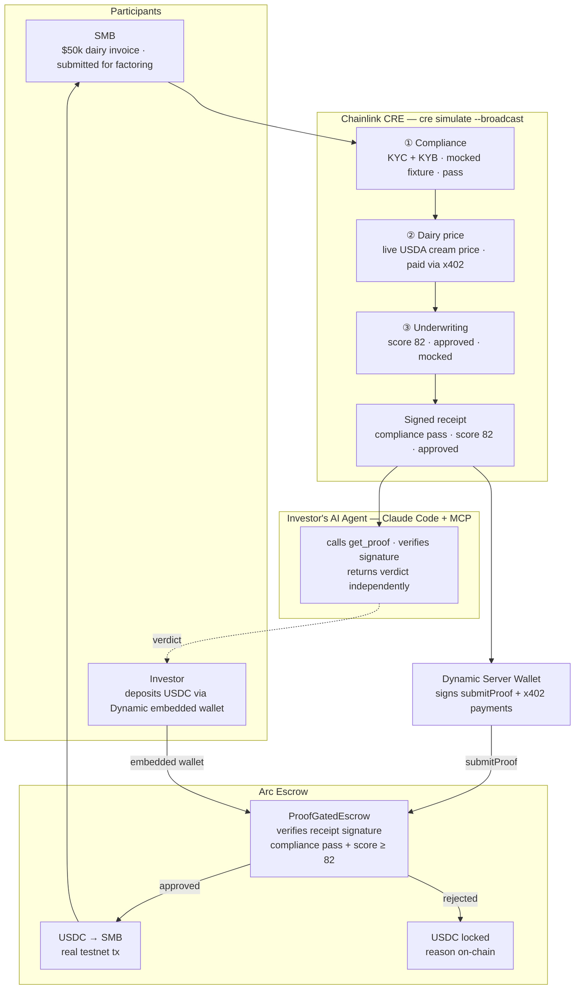
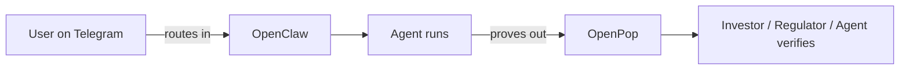

# OpenPop: The OpenClaw for Verifiable AI Workflows.

## What

**One liner:** OpenPop is the OpenClaw of verifiable agent workflows. Proof over Promises.

**What it does:** A framework that makes any trust-critical workflow verifiable by downstream agents — without trusting the operator. Wrap your handler in a CRE workflow, get a signed receipt, expose it via MCP. Any downstream agent can verify and continue. No human in the middle.

**Best for:** workflows with private inputs and a counterparty who needs to trust the output.

### Links

[Contract] ProofGatedEscrow  on Arc testnet
0x6aDEB480BB7b7c54bE7Fb80b56E7Cd23fBD30527

https://testnet.arcscan.app/address/0x6aDEB480BB7b7c54bE7Fb80b56E7Cd23fBD30527?tab=contract


[Demo] Live Studio
https://openpop.vercel.app/

[Demo] Invoice Financing Verifiable Workflow 

https://youtu.be/lS5N3-kqoGE

[Demo] Proof MCP

https://youtu.be/-wDAQe2TOuE

[Demo] CRE workflow run

https://youtu.be/Wh8rcqJCsk8

[X402] Dairy Price API x402

https://g78md4c7ke.execute-api.us-east-1.amazonaws.com/dairy/cream/price

https://github.com/jianruan-io/dairy-cream-price-x402-demo

## Why

**The problem — three things every trust-critical AI workflow needs:**
Every workflow a counterparty needs to trust requires three ingredients that are currently painful to wire up and impossible to prove:

| Ingredient | Examples | The pain |
|---|---|---|
| **Data Source** | prices, events | paid access, hard to audit — counterparty can't verify what data actually ran |
| **Policy Rules** | compliance, risk management | logic runs on a private server — counterparty has to take the operator's word |
| **Privacy Boundary** | PII, financials | raw inputs can't leave the operator's custody — but that custody is the trust problem |

A developer today has to assemble all three manually. At the end, the counterparty still just trusts the operator's word.

**The gap in current attempts — ERC-8004:**
ERC-8004 is the Ethereum standard for AI agent trust. It defined three pillars — Identity (who the agent is), Reputation (track record), and Validation (proof a task was done correctly). Identity and Reputation work. Validation is broken — it's self-reported. Any agent can post "I ran compliance, score: 99" with no cryptographic proof. It's like LinkedIn letting you write your own certifications. The standard defined the gap. We built the missing piece: a signed receipt from an independent hardware network that nobody — not the operator, not the developer — can fake.

**Why it matters — verification is the new economic bottleneck:**
Current AI frameworks collapsed the cost to automate. The remaining friction is verification. Counterparties can't act on an agent's output without trusting the operator — that trust is a manual check: an email, a PDF, a phone call. OpenPop collapses the cost to verify. Tasks that were stuck behind "high cost to verify" become automatically verifiable — proof is cryptographic, not a claim. The downstream agent reads the receipt via MCP and continues without a human in the loop.

---

## How

**Mechanism:** The developer writes a CRE workflow — a `handler(trigger, callback)` function in TypeScript. Inside that handler, privacy-sensitive steps use Chainlink capabilities: Confidential AI Attester (TEE-based LLM inference, inputs never leave the enclave) and Confidential HTTP (for fetching market data privately, paid via x402). Each CRE node runs the workflow independently; 7 of 9 must reach BFT consensus before the receipt is signed. The signed receipt is stored and exposed via MCP. Downstream agents call `get_proof` and trust the result without trusting the operator.

**What the developer writes:** the handler callback (business logic), `config.json` (thresholds, API URLs), and `secrets.yaml` (references to API keys). OpenPop handles the CRE workflow scaffolding, receipt storage, MCP server, and observer UI.

**Plugins in the invoice financing demo:** x402 pays for the live dairy cream price feed — any external data purchase works the same way. The CRE privacy boundary keeps raw invoice data in the enclave — any sensitive input does the same. Swap the handler and the whole framework reuses.

---

## Demo - Investor Trust Portal

**What the studio app is:** A trust portal. A live dashboard where an investor can see exactly what screening ran on a deal, read the cryptographic proof, and let their AI agent verify it independently. No calls, no PDFs, no taking anyone's word.

**Why Orbbit built this:** As an invoice factoring platform, we raise capital from investors who need to trust that every deal was properly screened before their money goes in. Today that trust is a promise. They trust our word that compliance passed and underwriting was done correctly. That is a ceiling on how much capital we can raise and how fast we can deploy it. If investors can verify instead of trust, their confidence goes up, their perceived risk goes down, and our cost of capital drops. OpenPop turns that promise into a proof.



---

## Dev Setup — HTTP vs HTTPS

There is a known tension between two parts of the stack:

| Mode | CRE workflow | Dynamic sign-in |
|---|---|---|
| `next dev` (HTTP) | ✅ works — `ConfidentialHTTPClient` connects to `http://localhost:3000` | ⚠️ test first — OTP email may work on HTTP localhost |
| `next dev --experimental-https` (HTTPS) | ❌ breaks — CRE's Go HTTP client rejects the self-signed cert | ✅ works |

**Run plain HTTP for demo:**
```bash
npm run dev   # http://localhost:3000
```

CRE's `ConfidentialHTTPClient` calls `http://localhost:3000/api/compliance` and `/api/underwriting`. The self-signed cert generated by `--experimental-https` is not trusted by the Go runtime, so those calls fail with a TLS error.

Dynamic's OTP sign-in works on HTTP in local development. If you ever need HTTPS (e.g. for secure cookies or a browser that blocks HTTP), the long-term fix is to add the Next.js self-signed cert to the system trust store so Go respects it.

---

## Tech Stack

| Category | Technology | What it does here |
|---|---|---|
| **Verifiable Execution** | Chainlink CRE | Runs the 3-step workflow locally via `cre simulate --broadcast`; 7-of-9 BFT consensus produces a signed receipt |
| | Chainlink Confidential AI Attester | Upgrade path: swap mocked underwriting for real TEE-based LLM inference — one-line change, requires booth credentials |
| **On-chain Settlement** | Arc (EVM testnet) | The chain where the escrow contract lives and the receipt is verified on-chain |
| | ProofGatedEscrow.sol | Holds investor USDC, verifies the CRE receipt signature, releases to SMB on pass or locks on fail |
| **Payments** | Arc x402 | Nanopayment protocol — Dynamic server wallet pays per-query for the live dairy cream price feed |
| **Wallet** | Dynamic Server Wallet | Signs the `submitProof` transaction and x402 payment — no human in the loop |
| | Dynamic Embedded Wallet | Investor deposits USDC into Arc escrow directly from the UI — no external wallet needed |
| **x402 API Integration** | Dairy cream price API | FastAPI on AWS Lambda — live USDA cream price data; pre-built prior to this hackathon ([jianruan-io/dairy-cream-price-x402-demo](https://github.com/jianruan-io/dairy-cream-price-x402-demo)) |
| **Application** | Next.js | OpenPop studio (pipeline + receipt) and investor trust portal (deposit + agent verdict) |
| | TypeScript | CRE workflow handler, MCP server, Next.js app |
| | proof.json | Flat file written by the CRE runner, read by the MCP server and Next.js API routes |

---


## Long-term Vision

OpenClaw abstracts the plumbing that makes personal AI work across channels. A developer does not wire up WhatsApp, Telegram, or Slack from scratch. They do not build message routing, session management, or channel adapters. OpenClaw handles all of that. The developer writes the skill. The framework handles the rest.

OpenPop does the same thing for the other side of the pipeline. A developer building a trust-critical workflow should not have to wire up a TEE enclave, figure out BFT consensus, build a proof store, or expose an MCP server from scratch. They write the handler. The framework handles the rest.

The pieces that get abstracted are the same across every workflow:

- **Data source** — how you pay for and fetch external data (x402 in this demo, but any paid API works the same way)
- **Privacy boundary** — how you keep raw inputs inside a trust boundary (Chainlink CRE TEE in this demo, but any trusted execution environment fits)
- **Policy rules** — the business logic that runs inside the boundary (the handler the developer writes)
- **Proof store** — where the signed output lands so anyone can read it (proof.json in this demo)
- **Verify MCP** — how downstream agents access and verify the proof (MCP server with `get_proof`)

OpenClaw made personal AI composable by abstracting channel plumbing. OpenPop makes verifiable AI composable by abstracting verification plumbing. The invoice factoring workflow is the first concrete instance. Every piece is a plugin.


### Analogy

OpenClaw routes work *into* agents. OpenPop proves what those agents *produced*.

| | OpenClaw | OpenPop |
|---|---|---|
| **Framework layer** | Wire up skills, channels, agents | Wire up CRE handler, receipt store |
| **Application you run** | Gateway UI + assistant | Receipt UI + MCP server |
| **Who builds with it** | Developers wire up agent skills | Developers wrap trust-critical functions |
| **Who consumes it** | End-users chat across channels | Counterparties (investors, regulators, agents) verify receipts |
| **Which side of the pipeline** | Input — routes messages into agents | Output — proves what agents produced |

They are complementary pieces of the same agent stack:




**Why it's generalizable:** The components are plugins. x402 is just the payment primitive — swap it for any data purchase. The CRE handler is just the business logic — swap it for any workflow. The privacy boundary (TEE enclave), proof store, and MCP server are the same regardless of what the workflow does. The invoice factoring demo is one instance; the pattern applies anywhere Party B can't act until they trust Party A's output.


## Agent Use Case: High-Stakes, Multi-Party Workflows With External Dependencies

The SMB / investor demo is one instance of a recurring structural problem: **Party A runs a workflow. Party B cannot act until they trust Party A's output. Today that trust is a manual bottleneck — an email, a PDF, a phone call.** OpenPop removes the bottleneck. Party A's workflow produces a signed receipt. Party B's agent reads it via MCP, verifies it independently, and triggers their downstream work automatically — no human relay, no blind trust.

This pattern applies across any industry where one party's verified output is a prerequisite for another party's action:

| Industry | Party A's Workflow | Why Party B Is Blocked Without Proof | Party B's Downstream Action Unlocked |
|---|---|---|---|
| **Finance — Lending** | KYC + credit underwriting on a borrower | Investor / lender won't release capital without knowing compliance ran on real data and the score threshold was actually met | Capital release, loan origination, USDC disbursement |
| **Finance — Insurance** | Actuarial risk assessment on a policy applicant | Underwriter won't bind coverage without proof the risk model ran on the correct inputs and wasn't manipulated | Policy issuance, premium setting, coverage binding |
| **Legal** | Contract review against a compliance rulebook | Counterparty won't execute or sign without proof the review ran, which rules were applied, and no clauses were skipped | Contract execution, digital signature, escrow release |
| **Healthcare** | Clinical trial eligibility screening on a patient record | Sponsor / CRO won't enroll the patient without proof the inclusion/exclusion criteria ran on real EHR data inside a privacy boundary — not self-reported by the site | Patient enrollment, trial activation, IRB reporting |
| **Supply chain** | Supplier audit against ESG or quality standards | Buyer won't issue a purchase order without proof the audit ran against the correct supplier data and wasn't self-reported | PO issuance, onboarding approval, payment terms unlock |
| **Real estate** | Title search and lien check before closing | Escrow agent won't release funds without proof the title check ran on the correct property records | Escrow release, deed transfer, mortgage funding |

The common structure in every row: **the downstream party has a hard dependency on the upstream workflow — not on the operator's word that it ran, but on cryptographic proof that it ran correctly.** OpenPop is the layer that converts that word into a proof.
