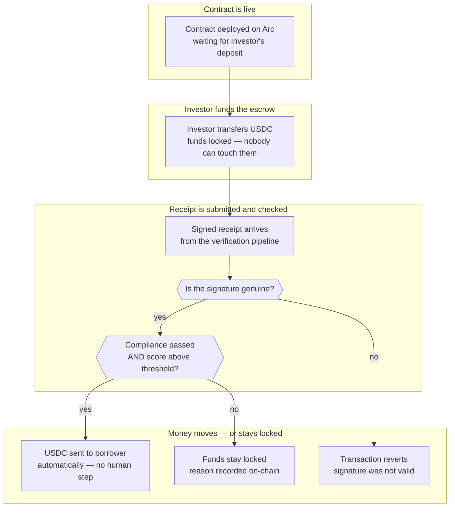

# ProofGatedEscrow on Arc

## Overview

**What:**
An investor can lock capital into a tamper-proof escrow on the Arc blockchain, knowing it will only reach the borrower if an independent cryptographic proof confirms that compliance and underwriting both passed — no human can approve, override, or intercept the release.

**Why:**
Without this contract, the receipt from the verification pipeline is just a file that anyone could fabricate or ignore. The capital release still depends on Orbbit's word. This contract removes Orbbit from the trust path entirely — the proof is the only key, and the contract enforces it.

**How:**
A smart contract holds the investor's funds in escrow. When the verification pipeline finishes, its signed receipt is submitted on-chain. The contract independently checks the signature and the policy conditions. If both pass, funds transfer to the borrower automatically. If either fails, funds stay locked with a reason recorded on-chain.

**Zone 1 check:**
Advances the **Deployment** stage of the capital cycle. Deployment is currently Zone 2 — capital release depends on a human operator approving the transfer after reading a receipt. This contract makes Deployment Zone 1: the release condition is a binary on-chain check, verifiable by any party with the contract address, with no human step in the critical path.

---

## Core Logic



- Always: USDC stays inside the contract from the moment of deposit until a receipt is submitted and verified on-chain — no withdrawal path exists outside of these two outcomes
- Never: USDC moves without both a valid signature from the verification network AND both policy conditions (compliance passed, score above threshold) being satisfied simultaneously

---

## File Tree

```
contracts/
├── foundry.toml                          ← Foundry config (src, test, solc version)
├── hardhat.config.ts                     ← Hardhat for deployment only
├── package.json                          ← deps; `npm test` runs `forge test`
├── contracts/
│   └── ProofGatedEscrow.sol             ← the escrow contract
└── test/
    ├── helpers/
    │   └── ProofGatedEscrowMocks.sol    ← minimal MockERC20 + MockForwarder
    └── ProofGatedEscrow/
        └── ProofGatedEscrow.t.sol       ← 7 Foundry unit tests
```

---

## Action Items

**[x] Scaffold Foundry project**

Implement: Create `contracts/foundry.toml` with `src = "contracts"`, `test = "test"`, `solc = "0.8.24"`, OZ remapping; install `forge-std`; update `package.json` with `@nomicfoundation/hardhat-foundry` and `test` script pointing to `forge test`.

Verify:
```bash
cd contracts && forge test
```
→ exits 0

---

**[x] ProofGatedEscrow.sol**

Implement: Create `contracts/contracts/ProofGatedEscrow.sol` with a state enum (`AWAITING_DEPOSIT`, `FUNDED`, `RELEASED`, `REJECTED`); constructor taking `usdc address`, `forwarder address`, `recipient address`, `scoreThreshold uint256`; `depositUSDC(uint256 amount)` — requires state `AWAITING_DEPOSIT`, calls `IERC20.transferFrom`, transitions to `FUNDED`, emits `Funded`; `submitProof(bool compliant, uint256 score, bytes calldata sig)` — requires state `FUNDED`, calls `IKeystoneForwarder.verify`, checks policy, either releases USDC to recipient (emits `Released`) or locks with reason (emits `Rejected`).

Verify:
```bash
cd contracts && forge build
```
→ exits 0

---

**[x] Unit tests**

Implement: Create `contracts/test/ProofGatedEscrow/ProofGatedEscrow.t.sol` and `contracts/test/helpers/ProofGatedEscrowMocks.sol` covering all contract functions per `specs/M0-minimum-viable/TECH-177-proof-gated-escrow-arc/test.md`.

Verify:
```bash
cd contracts && forge test
```
→ 7 passed, 0 failed
