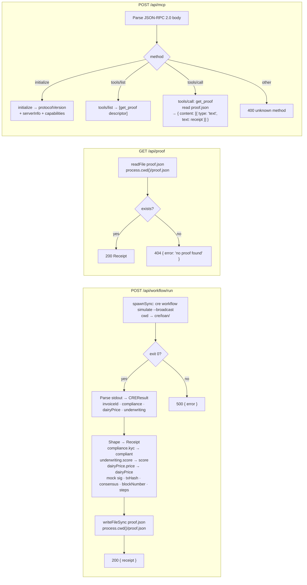

# API Routes — BFF Layer

## Overview

**What:**
The studio app gains three server-side endpoints that connect the UI to the live OpenPop verification pipeline — triggering a real CRE screening run, exposing the signed receipt for human review, and publishing a machine-readable proof tool that any AI agent can call without trusting the operator.

**Why:**
Without these endpoints the studio page renders a hardcoded fixture forever — judges and investors see a static snapshot, not a live pipeline. Aaron's AI agent has no tool to call, the receipt panel has no live data to fetch, and there is no way to trigger a real CRE run from the UI. All three endpoints are L0 blockers.

**How:**
Three Next.js route handlers form the BFF layer: one runs the CRE verification pipeline on demand and writes the signed receipt to disk, one reads that receipt back for any consumer, and one exposes it as an MCP tool so downstream agents can verify the proof independently without asking anyone.

**Zone 1 check:**
Implementation — advances L0 from static fixture to live pipeline output. Verification is calling each route and observing the correct response shape and status code.

---

## Core Logic



### Business rules

- `/api/workflow/run` only writes `proof.json` when CRE exits 0 — a partial or failed receipt must never be written
- The Receipt written to `proof.json` must satisfy the `Receipt` type in `apps/studio/src/types/receipt.ts` exactly — no extra fields, no missing fields
- `compliant` is derived from `compliance.kyc === 'pass' && compliance.kyb === 'pass' && compliance.sanctions === 'clean'`; `approved` is `underwriting.approved`
- `GET /api/proof` returns 404 (not 500) when `proof.json` does not exist — absence is an expected state before any run has been triggered
- MCP endpoint is stateless — no session management, no streaming; each POST is a self-contained JSON-RPC exchange
- `tools/call` with any name other than `get_proof` returns 400 with a JSON-RPC error body (code -32601, message "method not found")
- `proof.json` path is `path.join(process.cwd(), 'proof.json')` — resolved once at module level in each route that reads or writes it

---

## File Tree

```
apps/studio/
  src/app/api/
    workflow/run/
      route.ts        ← POST handler: CRE simulate → shape → write proof.json → return Receipt
    proof/
      route.ts        ← GET handler: read proof.json → 200 Receipt or 404
    mcp/
      route.ts        ← POST handler: MCP Streamable HTTP, get_proof tool
  proof.json          ← runtime-created by /api/workflow/run; gitignored
specs/m0-mvp/TECH-181-api-routes-bff-layer/
  spec.md             ← this file
```

---

## Action Items

**[x] Create POST /api/workflow/run route handler**

Implement: Create `apps/studio/src/app/api/workflow/run/route.ts` — POST handler that calls `spawnSync('cre', ['workflow', 'simulate', '--broadcast'], { cwd: path.join(process.cwd(), '../../cre/loan'), encoding: 'utf-8' })`, parses the stdout JSON into a `CREResult`, shapes it into the `Receipt` type (deriving `compliant` from compliance fields, `score` and `approved` from underwriting, `dairyPrice` from the price result, mock values for `signature`, `txHash`, `prover`, `consensus`, `blockNumber`, and step metadata strings), writes the receipt to `proof.json` at `process.cwd()`, and returns `NextResponse.json({ receipt })` with 200 on success or `NextResponse.json({ error }, { status: 500 })` on any failure.

Verify:
```bash
cd apps/studio && npx tsc --noEmit
```
→ exits 0

---

**[x] Create GET /api/proof route handler**

Implement: Create `apps/studio/src/app/api/proof/route.ts` — GET handler that reads `proof.json` from `process.cwd()` using `fs/promises`, parses it as `Receipt`, and returns `NextResponse.json(receipt)` with 200, or `NextResponse.json({ error: 'no proof found' }, { status: 404 })` when the file does not exist.

Verify:
```bash
cd apps/studio && npx tsc --noEmit
```
→ exits 0

---

**[x] Create POST /api/mcp route handler**

Implement: Create `apps/studio/src/app/api/mcp/route.ts` — stateless MCP Streamable HTTP POST handler that parses the JSON-RPC 2.0 request body and dispatches: `initialize` → `{ protocolVersion: "2025-03-26", capabilities: { tools: {} }, serverInfo: { name: "openpop-mcp", version: "0.1.0" } }`; `tools/list` → `{ tools: [{ name: "get_proof", description: "Read the signed OpenPop receipt from the last CRE simulation run", inputSchema: { type: "object", properties: {} } }] }`; `tools/call` with `params.name === "get_proof"` → read `proof.json`, return `{ content: [{ type: "text", text: JSON.stringify(receipt) }] }`; any other method → `NextResponse.json({ error: { code: -32601, message: "method not found" } }, { status: 400 })`.

Verify:
```bash
cd apps/studio && npx tsc --noEmit
```
→ exits 0
