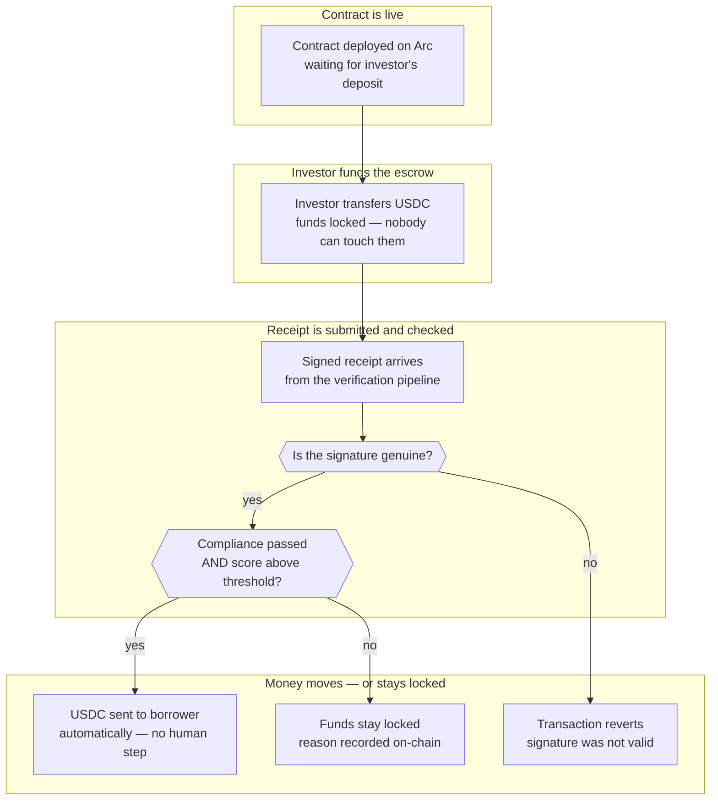

# ProofEscrow on Arc

## Overview

**What:**
An investor can lock capital into a tamper-proof escrow on the Arc blockchain, knowing it will only reach the borrower if an independent cryptographic proof confirms that compliance and underwriting both passed — no human can approve, override, or intercept the release.

**Why:**
Without this contract, the receipt from the verification pipeline is just a file that anyone could fabricate or ignore. The capital release still depends on Orbbit's word. This contract removes Orbbit from the trust path entirely — the proof is the only key, and the contract enforces it.

**How:**
A smart contract holds the investor's funds in escrow. When the verification pipeline finishes, its signed receipt is submitted on-chain. The contract independently checks the signature and the policy conditions. If both pass, funds transfer to the borrower automatically. If either fails, funds stay locked with a reason recorded on-chain.

**Zone 1 check:**
Advances the **Deployment** stage of the capital cycle. Deployment is currently Zone 2 — capital release depends on a human operator approving the transfer after reading a receipt. This contract makes Deployment Zone 1: the release condition is a binary on-chain check, verifiable by any party with the contract address, with no human step in the critical path.

---

## Core Logic



- Always: USDC stays inside the contract from the moment of deposit until a receipt is submitted and verified on-chain — no withdrawal path exists outside of these two outcomes
- Never: USDC moves without both a valid signature from the verification network AND both policy conditions (compliance passed, score above threshold) being satisfied simultaneously

---

## File Tree

```
contracts/
├── package.json            ← Hardhat project dependencies and scripts
├── tsconfig.json           ← TypeScript config for Hardhat and tests
├── hardhat.config.ts       ← default Hardhat network only
├── ProofEscrow.sol         ← the escrow contract
└── test/
    ├── MockForwarder.sol   ← configurable verify() stub for test control
    └── ProofEscrow.test.ts ← 7 contract tests
```

---

## Action Items

**[x] Scaffold Hardhat TypeScript project**

Implement: Create `contracts/package.json` with Hardhat, ethers, and TypeScript test dependencies; `contracts/tsconfig.json`; `contracts/hardhat.config.ts` with the default in-process Hardhat network only.

Verify:
```bash
cd contracts && npx hardhat compile
```
→ exits 0, "Compiled 0 Solidity files"

---

**[x] ProofEscrow.sol**

Implement: Create `contracts/ProofEscrow.sol` with a state enum (`AWAITING_DEPOSIT`, `FUNDED`, `RELEASED`, `REJECTED`); constructor taking `usdc address`, `forwarder address`, `recipient address`, `scoreThreshold uint256`; `depositUSDC(uint256 amount)` — requires state `AWAITING_DEPOSIT`, calls `IERC20.transferFrom`, transitions to `FUNDED`, emits `Funded(address depositor, uint256 amount)`; `submitProof(bool compliant, uint256 score, bytes calldata sig)` — requires state `FUNDED`, calls `IKeystoneForwarder(forwarder).verify(abi.encode(compliant, score, sig))` and reverts on false, calls `_checkPolicy(compliant, score)` then either `_release()` (transitions to `RELEASED`, transfers USDC to recipient, emits `Released`) or `_reject(string reason)` (transitions to `REJECTED`, emits `Rejected`).

Verify:
```bash
cd contracts && npx hardhat compile
```
→ exits 0, "Compiled 1 Solidity file successfully"

---

**[x] MockForwarder.sol**

Implement: Create `contracts/test/MockForwarder.sol` with a `constructor(bool _result)` and a `verify(bytes calldata) external view returns (bool)` that returns the constructor value — lets each test independently control whether signature verification passes or fails.

Verify:
```bash
cd contracts && npx hardhat compile
```
→ exits 0, "Compiled 2 Solidity files successfully"

---

**[x] Unit tests**

Implement: Create `contracts/test/ProofEscrow.test.ts` covering all `ProofEscrow` contract functions per `specs/TECH-177-proof-escrow-arc/test.md`.

Verify:
```
cd contracts && npx hardhat test
```
→ all pass, none skipped
