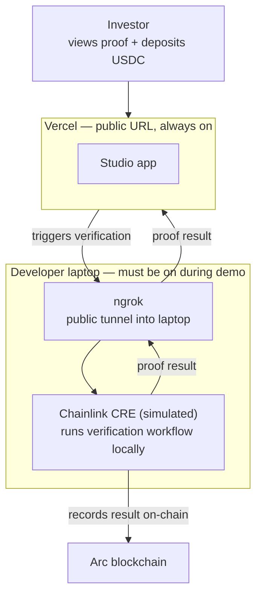

# OpenPop — Deployment Plan

## Why CRE can't be deployed

`cre simulate` is a CLI tool. It runs the Chainlink DON locally on your machine — simulating all 7-of-9 consensus nodes in one process. There is no server to deploy it to.

The production path is the **real Chainlink DON**: you register your workflow with Chainlink's network and their nodes run it. That requires Early Access credentials from Chainlink. Without them, simulation is the only option.

So the split is permanent until Early Access is granted:

| | Where it runs | Why |
|---|---|---|
| Studio UI | Vercel | Standard Next.js app |
| Compliance + Underwriting mocks | Vercel | Next.js API routes — trivial JSON responses |
| x402 dairy price fetch | Vercel | HTTP call with a wallet — works in serverless |
| **`cre simulate --broadcast`** | **Laptop only** | CLI binary — can't run on Vercel or any serverless host |
| Arc `submitProof` tx | Arc testnet | Called by CRE during simulate |

---

## Logic and boundaries



**The boundary:** the Vercel app is always up. The CRE verification only runs when the laptop is on. Investors can always view a pre-run proof even if the laptop is off.

---

## What needs to be built

The current `workflow/run/route.ts` shells out `cre simulate` directly — it assumes the Next.js app and CRE are on the same machine. For the Vercel split, two changes are needed:

1. **Extract CRE runner to a standalone server** (`cre/runner-server.ts`) — a small HTTP server on the laptop that accepts a POST and runs `cre simulate --broadcast`
2. **Update `workflow/run/route.ts`** — keep the x402 dairy price fetch on Vercel, then proxy to the CRE runner instead of shelling out locally

---

## One-Time Setup

### 1. Environment variables

**Vercel** (set in dashboard):
```
DYNAMIC_WALLET_PASSWORD=0x...              # Base Sepolia wallet for dairy price x402 payment
DAIRY_PRICING_API_URL=https://...           # Orbbit dairy cream price API
CRE_RUNNER_URL=https://abc123.ngrok-free.app   # update each demo session
```

**Laptop** (`cre/.env`):
```
CRE_ETH_PRIVATE_KEY=0x...          # Arc testnet wallet for submitProof gas
```

### 2. Point CRE at Vercel for compliance + underwriting

`cre/invoice-financing/config.staging.json`:
```json
{
  "complianceApiUrl": "https://your-app.vercel.app/api/compliance",
  "underwritingApiUrl": "https://your-app.vercel.app/api/underwriting"
}
```

### 3. Pre-run and commit proof.json

Run once end-to-end, copy the output into `apps/studio/proof.json`, commit it. This is the fallback that Vercel's `/api/proof` and MCP serve when the laptop is offline.

---

## Day-of Setup

### Terminal 1 — CRE runner server
```bash
cd cre && node runner-server.js
# listens on localhost:3001
```

### Terminal 2 — ngrok
```bash
ngrok http 3001
# copy the https URL
```

### Update Vercel env var
In Vercel dashboard → `CRE_RUNNER_URL` → paste the ngrok URL → redeploy (takes ~30s).

### Verify
```bash
# proof fallback (Vercel, always works)
curl https://your-app.vercel.app/api/proof

# live run through ngrok
curl -X POST https://your-app.vercel.app/api/workflow/run
```

---

## Fallback Plan

If the laptop goes offline mid-demo:

- Studio UI still loads on Vercel
- `/api/proof` returns the pre-committed `proof.json` — real Arc tx hash, real results
- MCP still serves `get_proof` — Aaron's agent still works
- "Run Workflow" button will error — but the receipt panel already shows the proof
- Point judge to the Arc block explorer link in the receipt

---

## Upgrade Paths

| Upgrade | What changes | When |
|---|---|---|
| No laptop dependency | Deploy runner-server to Railway with CRE CLI in Dockerfile | After hackathon |
| Real Chainlink DON | Register workflow with Chainlink, swap `MockKeystoneForwarder` → `KeystoneForwarder` | If Early Access granted at booth |
| Dynamic Flow | Add Flow widget to investor deposit panel | L1 from CLAUDE.md |
