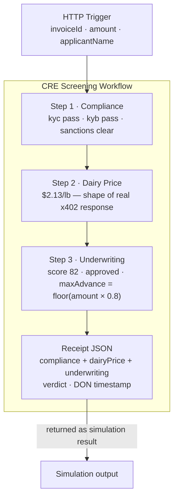

# CRE Workflow: Verifiable Loan Deal

## Overview

**What:**
A verified screening pipeline that checks an invoice applicant's identity, fetches the current dairy commodity price, and scores their creditworthiness — producing a signed receipt any downstream party can trust without contacting Orbbit.

**Why:**
Without a receipt, Aaron's agent has no way to verify that screening ran at all — he must take Orbbit's word. That blind trust is what limits liquidity. The escrow contract, the MCP server, and every downstream agent all depend on this receipt existing before they can act.

**How:**
Three screening steps run in sequence inside a decentralized compute network; each node executes the same logic independently and the network signs the result only after reaching consensus. All three steps use hardcoded example values for this sprint — the point is the CRE plumbing, not the business values.

**Zone 1 check:**
Execution pipeline — Implementation. The handler is a plain exported TypeScript function with deterministic outputs. Verification is running unit tests against a mock runtime and confirming `cre workflow simulate` exits 0.

---

## Core Logic

All three steps use hardcoded example values — no real external calls, no real formulas. The plumbing is what matters: HTTP trigger → sequential steps → receipt JSON.

- Step 1 (compliance): `kyc: "pass"`, `kyb: "pass"`, `sanctions: "clear"` — hardcoded for Gallivant Ice Cream
- Step 2 (dairy price): `price: 2.13`, `unit: "USD/lb"` — hardcoded, shape matches the real Orbbit API response
- Step 3 (underwriting): `score: 82`, `approved: true`, `maxAdvanceUsdc: Math.floor(amount × 0.8)` — hardcoded except the advance calculation



- Always: all three steps run and all three results appear in the receipt
- Never: partial receipt — the workflow either returns all three or throws

---

## File Tree

```
cre/
  invoice-financing/
    main.ts                 ← HTTP handler: 3 steps → receipt JSON
    package.json
    tsconfig.json
    workflow.yaml           ← HTTP trigger, staging target, config path
    config.staging.json     ← dairyPriceMockUsdPerLb, defaultApplicantName
  project.yaml              ← minimal staging settings (no EVM chain)
  secrets.yaml              ← empty skeleton
  .env.example              ← CRE_ETH_PRIVATE_KEY placeholder
```

---

## Action Items

**[ ] Create the project folder structure**

Implement: Run `cre init` to generate the `cre/` folder with a TypeScript starter template named `screening`.

Verify:
```
ls cre/invoice-financing/main.ts cre/project.yaml cre/secrets.yaml
```
→ exits 0, all three files exist

---

**[ ] Install dependencies**

Implement: Run `bun install` (and `bunx cre-setup` if it didn't run automatically) inside `cre/invoice-financing/`.

Verify:
```
ls cre/invoice-financing/node_modules/@chainlink/cre-sdk/package.json
```
→ exits 0

---

**[ ] Write the config files**

Implement: Set `cre/invoice-financing/workflow.yaml` to use an HTTP trigger; write `cre/invoice-financing/config.staging.json` with the mock dairy price (`2.13`) and default applicant name; write minimal `cre/project.yaml`, empty `cre/secrets.yaml`, and `cre/.env.example` with a private key placeholder.

Verify:
```
python3 -c "import json; d=json.load(open('cre/invoice-financing/config.staging.json')); assert d['dairyPriceMockUsdPerLb'] == 2.13; print('ok')"
```
→ prints `ok`

---

**[ ] Write the function that runs the three steps and returns the receipt**

Implement: Replace `cre/invoice-financing/main.ts` with a function that receives the invoice request, runs the three hardcoded steps one by one, packages all the results into a receipt object, and returns it as a JSON string. Each step logs its name so it's visible in the simulation output.

Verify:
```
cd cre/screening && npx tsc --noEmit
```
→ exits 0

---

**[ ] Integration test: run the simulation**

Implement: Run the simulation with a test invoice to confirm the function compiles and executes correctly inside the CRE runtime.

Verify:
```
cd cre && cre workflow simulate screening \
  --non-interactive \
  --trigger-index 0 \
  --http-payload '{"invoiceId":"GALLIVANT-001","amount":50000,"applicantName":"Gallivant Ice Cream"}' \
  --target staging-settings
```
→ exits 0; output shows `[Step 1]`, `[Step 2]`, `[Step 3]`; result is valid JSON with `"verdict":"approved"`, `"score":82`, `"maxAdvanceUsdc":40000`
