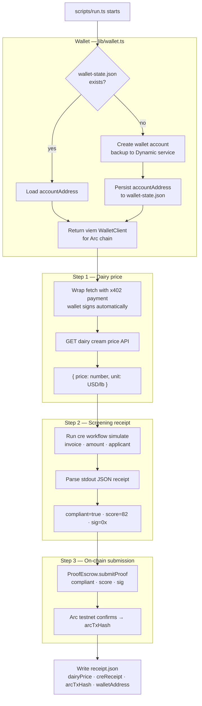

# Dynamic Server Wallet

## Overview

**What:**
After the verification pipeline completes, capital is released without any human signing a transaction. A persistent server wallet pays for live market data and submits the cryptographic proof to the escrow contract — entirely autonomously.

**Why:**
Without a server-side wallet, a human must manually approve two on-chain actions after every screening run: the micropayment to fetch the live dairy price, and the proof submission that unlocks the borrower's capital. That manual step is the last human bottleneck and contradicts the core claim of the demo — that proof, not people, controls capital.

**How:**
A server wallet is initialised once and its address persisted across runs. On each orchestration run, the wallet settles the market data API call via the HTTP 402 payment protocol, then signs and broadcasts the proof submission to the escrow contract on Arc — with no human in the loop at either step.

**Zone 1 check:**
Execution pipeline — Implementation. The orchestrator calls the Dynamic SDK, an x402-protected API, the CRE CLI, and the Arc testnet in sequence. Verification is running `scripts/run.ts` with real credentials and confirming `receipt.json` contains a valid Arc tx hash.

---

## Core Logic



### Business rules

- Wallet is created once; `wallet-state.json` persists the address so every run reuses the same on-chain identity — never creates a duplicate wallet
- The three steps (x402 fetch, CRE simulate, submitProof) run in strict sequence; any failure exits non-zero and `receipt.json` is not written
- `receipt.json` is written only after `arcTxHash` is confirmed — a partial receipt with no tx hash must never be written
- No file under `cre/` or `contracts/` may be created or modified — those are TECH-176 and TECH-177 scope

---

## File Tree

```
package.json              ← root ESM project; deps: @dynamic-labs-wallet/node-evm, @dynamic-labs-wallet/core, viem, x402-fetch
tsconfig.json             ← TypeScript config for lib/ and scripts/, ES2022 modules, strict
.env.example              ← all required env var names with placeholder values
.wallet-state.json        ← runtime-created; persists accountAddress across runs (gitignored)
lib/
  wallet.ts               ← Dynamic client init, create-or-load wallet account, viem WalletClient factory for Arc
scripts/
  run.ts                  ← orchestrator: x402 dairy price → CRE simulate → submitProof → receipt.json
receipt.json              ← runtime-created; gitignored
```

---

## Action Items

**[x] Scaffold root package.json and tsconfig.json**

Implement: Create `package.json` with `"type": "module"`, pnpm esbuild config, production deps (`@dynamic-labs-wallet/node-evm`, `@dynamic-labs-wallet/core`, `viem`, `x402-fetch`) and dev deps (`tsx`, `typescript`). Create `tsconfig.json` targeting ES2022 modules, strict mode, covering `lib/` and `scripts/`.

Verify:
```bash
bun install && ls node_modules/@dynamic-labs-wallet/node-evm/package.json
```
→ exits 0

---

**[x] Create lib/wallet.ts**

Implement: Export `getViemWalletClient(chainId: number, rpcUrl: string)` with these behaviours:
- authenticates a `DynamicEvmWalletClient` using env credentials
- loads `accountAddress` from `.wallet-state.json` when the file exists
- when the file does not exist, creates a new wallet account backed up to Dynamic's service and writes `{ accountAddress }` to `.wallet-state.json`
- returns a viem `WalletClient` scoped to the given `chainId` and `rpcUrl`

Verify:
```bash
npx tsc --noEmit
```
→ exits 0

---

**[x] Create scripts/run.ts**

Implement: Orchestrator that executes the four steps in sequence:
- initialises the wallet client via `getViemWalletClient` with Arc chain config from env
- wraps `fetch` with x402 payment handler, calls `DAIRY_PRICING_API_URL`, parses `{ price, unit }` as `dairyPrice`
- runs `cre workflow simulate` via `execSync`, parses the JSON receipt from stdout as `creReceipt`
- calls `ProofEscrow.submitProof(compliant, score, sig)` via `walletClient.writeContract` with the inline ABI fragment, using `"0x"` for `sig` (MockForwarder accepts any bytes), and captures `arcTxHash`
- writes `receipt.json` with `{ dairyPrice, creReceipt, arcTxHash, walletAddress }`

Verify:
```bash
npx tsc --noEmit
```
→ exits 0

---

**[x] Create .env.example**

Implement: Write `.env.example` with seven entries: `DYNAMIC_AUTH_TOKEN`, `DYNAMIC_ENVIRONMENT_ID`, `DYNAMIC_WALLET_PASSWORD`, `ARC_RPC_URL`, `ARC_CHAIN_ID`, `PROOF_ESCROW_ADDRESS`, `DAIRY_PRICING_API_URL` — each with a placeholder value.

Verify:
```bash
grep -c "=" .env.example
```
→ prints `7`

---

**[x] Unit tests for lib/wallet.ts**

Implement: Create `lib/wallet.test.ts` covering the create-or-load branch in `getViemWalletClient`:
- when `.wallet-state.json` exists — loads `accountAddress` from file, does not call `createWalletAccount`, calls `getWalletClient` with the loaded address
- when `.wallet-state.json` does not exist — calls `createWalletAccount`, writes `{ accountAddress }` to file, calls `getWalletClient` with the new address

Mock `fs`, the Dynamic SDK client, and env vars. Do not hit the network.

Verify:
```bash
npx tsx --test lib/wallet.test.ts
```
→ all pass, none skipped
