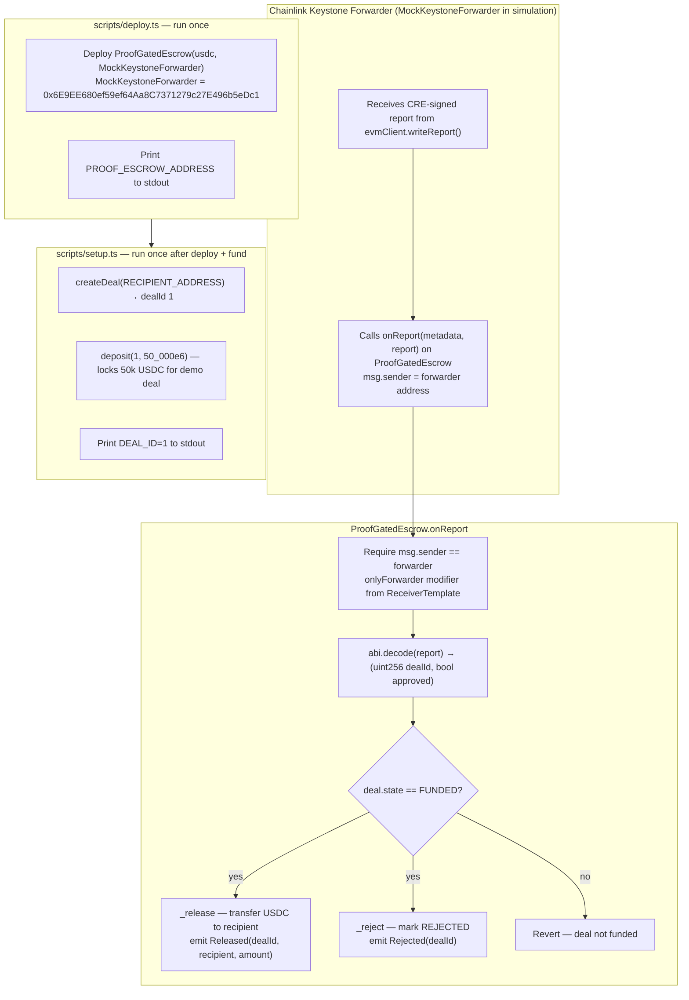

# ProofGatedEscrow — onReport interface, Arc deploy, demo deal setup

## Overview

**What:**
`ProofGatedEscrow` accepts CRE-signed verdicts through the Chainlink-standard receiver interface and releases investor capital to the business automatically when the network approves the deal. A one-time deploy script provisions the contract on Arc testnet and a setup script registers and funds the demo deal.

**Why:**
The current contract has a custom `submitProof` entry point that must be called by an external orchestrator — it cannot receive a verdict directly from the Chainlink network. This means `evmClient.writeReport()` in the CRE workflow has nowhere to land, the forwarder call reverts, and the "proof-gated release" story never closes. Nothing downstream of the contract can be built until this is fixed.

**How:**
The contract implements `IReceiver.onReport` — the standard interface the Chainlink Keystone Forwarder uses to deliver verdicts to consumer contracts. The forwarder calls `onReport`, the contract decodes the deal ID and approval verdict from the report bytes, and either releases USDC to the recipient or locks it permanently. A deploy script provisions the contract and a setup script creates and funds the demo deal.

**Zone 1 check:**
Implementation. Advances the Contracts layer of 03 · Integration. Verification is binary: `forge test` passes, and `npx hardhat run scripts/deploy.ts` prints a valid Arc contract address.

---

## Core Logic



### Business rules

- `onReport` reverts if `msg.sender` is not the registered forwarder — no external party can submit a verdict directly
- `onReport` reverts if `deal.state != FUNDED` — proof submitted before deposit is ignored
- `abi.decode(report, (uint256, bool))` must exactly match `encodeAbiParameters(parseAbiParameters("(uint256 dealId, bool approved)"), [...])` in the CRE workflow
- State transitions are terminal: `RELEASED` and `REJECTED` deals cannot be re-submitted
- `_release` transfers the exact `deal.amount` stored at deposit time — not the current contract balance — so other deals' funds are never touched
- `MockKeystoneForwarder` at `0x6E9EE680ef59ef64Aa8C7371279c27E496b5eDc1` always returns `true` for simulation — no custom forwarder needed
- Deploy script reads `DEPLOYER_PRIVATE_KEY`, `USDC_ADDRESS`, `ARC_RPC_URL` from env — prints `PROOF_ESCROW_ADDRESS` only
- Setup script reads `PROOF_ESCROW_ADDRESS`, `RECIPIENT_ADDRESS`, `USDC_ADDRESS` from env — prints `DEAL_ID=1`

---

## Tests

**Type: Foundry unit tests** (`forge test`) — all run locally against mocks, no Arc testnet required.
Deploy and setup scripts have no unit tests; they are verified by their Verify clauses running against Arc.

| # | Suite | Test | Type |
|---|---|---|---|
| 1 | `ProofGatedEscrow_onReport` | authorized forwarder + `approved=true` → USDC released to recipient, `Released` event emitted | ✅ unit |
| 2 | `ProofGatedEscrow_onReport` | authorized forwarder + `approved=false` → deal marked `REJECTED`, `Rejected` event emitted | ✅ unit |
| 3 | `ProofGatedEscrow_onReport` | unauthorized caller (not forwarder) → reverts | ✅ unit |
| 4 | `ProofGatedEscrow_onReport` | deal state is not `FUNDED` → reverts | ✅ unit |
| 5 | `ProofGatedEscrow_onReport` | contract USDC balance is exactly zero after release | ✅ unit |
| 6 | `ProofGatedEscrow_createDeal` | deal stored with correct fields, `nextDealId` increments | ✅ unit (carry over) |
| 7 | `ProofGatedEscrow_createDeal` | zero recipient address reverts | ✅ unit (carry over) |
| 8 | `ProofGatedEscrow_deposit` | full amount locked for deal | ✅ unit (carry over) |
| 9 | `ProofGatedEscrow_deposit` | second deposit on same deal reverts | ✅ unit (carry over) |

Tests 6–9 are carried over from the existing suite unchanged. Tests 1–5 replace the old `submitProof` suite.

No E2E or integration tests in this sprint — the `--broadcast` simulation (integration boundary) is the CRE Workflow sprint's verify step.

---

## File Tree

```
contracts/
  contracts/
    interfaces/
      IERC165.sol          ← new: copied from Chainlink docs — required by IReceiver
      IReceiver.sol        ← new: copied from Chainlink docs — onReport interface
      ReceiverTemplate.sol ← new: copied from Chainlink docs — provides onlyForwarder modifier
    ProofGatedEscrow.sol   ← rewrite: drop submitProof + IKeystoneForwarder; implement IReceiver.onReport
  test/
    ProofGatedEscrow/
      ProofGatedEscrow.t.sol ← update: rename submitProof suite → onReport; update call sites
    helpers/
      ProofGatedEscrowMocks.sol ← update: drop MockForwarder.verify(); no interface change needed
  scripts/
    deploy.ts              ← new: deploy ProofGatedEscrow, print PROOF_ESCROW_ADDRESS
    setup.ts               ← new: createDeal + deposit, print DEAL_ID=1
.env.example               ← update: add DEPLOYER_PRIVATE_KEY, USDC_ADDRESS, RECIPIENT_ADDRESS; remove DAIRY_PRICING_API_URL
```

---

## Action Items

**[ ] Copy IReceiver interfaces into `contracts/contracts/interfaces/`**

Implement: Create `IERC165.sol`, `IReceiver.sol`, and `ReceiverTemplate.sol` in `contracts/contracts/interfaces/` — copied verbatim from the Chainlink CRE consumer contracts documentation. `ReceiverTemplate` provides the `onlyForwarder` modifier and stores the forwarder address as `immutable`.

Verify:
```bash
ls contracts/contracts/interfaces/ | wc -l
```
→ `3`

---

**[ ] Rewrite `contracts/contracts/ProofGatedEscrow.sol`**

Implement: Rewrite `ProofGatedEscrow.sol` — remove `submitProof`, remove the custom `IKeystoneForwarder` interface, inherit from `ReceiverTemplate`, implement `onReport(bytes calldata metadata, bytes calldata report)` which decodes `(uint256 dealId, bool approved)` from `report`, requires `deal.state == FUNDED`, then calls `_release` or `_reject`. Constructor takes `(address usdc_, address forwarder_)` and passes `forwarder_` to `ReceiverTemplate`.

Verify:
```bash
cd contracts && forge build 2>&1 | tail -1
```
→ `Compiler run successful`

---

**[ ] Update `contracts/test/ProofGatedEscrow/ProofGatedEscrow.t.sol`**

Implement: Update the test file — rename `ProofGatedEscrow_submitProof` suite to `ProofGatedEscrow_onReport`; replace every `escrow.submitProof(dealId, approved, sig)` call with `vm.prank(address(forwarder)); escrow.onReport("", abi.encode(dealId, approved))`; add one test that `vm.prank(attacker); escrow.onReport(...)` reverts (unauthorized caller replaces the old forwarder-rejects-signature test).

Verify:
```bash
cd contracts && forge test --match-contract ProofGatedEscrow -v 2>&1 | tail -3
```
→ all tests pass, 0 failures

---

**[ ] Create `contracts/scripts/deploy.ts`**

Implement: Create `contracts/scripts/deploy.ts` — a Hardhat script that deploys `ProofGatedEscrow` with `USDC_ADDRESS` and the hardcoded `MockKeystoneForwarder` address (`0x6E9EE680ef59ef64Aa8C7371279c27E496b5eDc1`) as constructor arguments, then prints `PROOF_ESCROW_ADDRESS=<address>` to stdout.

Verify:
```bash
cd contracts && npx hardhat run scripts/deploy.ts --network arc 2>&1 | grep -c "PROOF_ESCROW_ADDRESS="
```
→ `1`

---

**[ ] Create `contracts/scripts/setup.ts`**

Implement: Create `contracts/scripts/setup.ts` — a Hardhat script that reads `PROOF_ESCROW_ADDRESS` and `RECIPIENT_ADDRESS` from env, calls `createDeal(recipient)`, calls `deposit(1, 50_000_000_000n)` (50k USDC at 6 decimals) after approving the escrow, then prints `DEAL_ID=1` to stdout.

Verify:
```bash
cd contracts && npx hardhat run scripts/setup.ts --network arc 2>&1 | grep -c "DEAL_ID="
```
→ `1`

---

**[ ] Update `.env.example`**

Implement: Add `DEPLOYER_PRIVATE_KEY`, `USDC_ADDRESS`, `RECIPIENT_ADDRESS` to `.env.example`. Remove `DAIRY_PRICING_API_URL`. Keep all existing Dynamic and Arc variables.

Verify:
```bash
grep -c "=" .env.example
```
→ `9` or more
