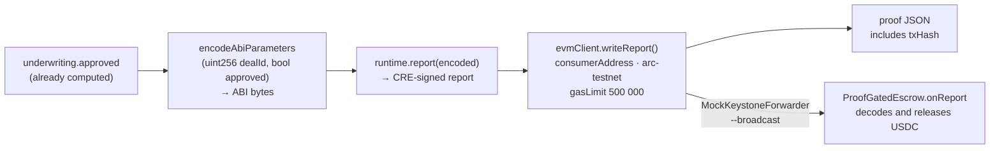

# CRE Workflow — Computation Layer Integration

## Overview

**What:**
The Chainlink workflow can now write its own verdict on-chain as its final step — no human relay, no external orchestrator.

**Why:**
Without an on-chain write step, the CRE workflow produces a local verdict that goes nowhere. USDC stays locked, Aaron has nothing to verify, and the core promise of the demo — proof, not a promise — cannot be demonstrated.

**How:**
The workflow appends one step after underwriting: encode the deal ID and approval verdict as ABI bytes, sign the report inside the CRE runtime, and write it directly to the escrow contract through the Chainlink forwarder. Fixture HTTP endpoints stand in for real compliance and underwriting APIs so the simulation can run without live credentials.

**Zone 1 check:**
Implementation. Advances the CRE Workflow sub-layer of 03 · Integration in M0 — MVP. Verification is binary: `cre workflow simulate --broadcast` prints an Arc testnet tx hash.

> **No tests.** All four Action Items are SDK wiring calls, a config file, and a fixture server with hardcoded returns — no branching business logic exists to reason about. Acceptance is binary: `cre workflow simulate --broadcast` prints an Arc tx hash or it doesn't.

---

## Core Logic

The handler currently returns a JSON verdict string and stops. `cre workflow simulate --broadcast` with no `writeReport()` call is a no-op — the `--broadcast` flag deploys a `MockKeystoneForwarder` but nothing ever calls it.

The fix appends three lines at the end of `onInvoiceSubmitted`:



### Business rules

- Without `writeReport()` in the handler, `--broadcast` produces no Arc tx — the flag has no effect
- ABI encoding `(uint256, bool)` must match `abi.decode(report, (uint256, bool))` in `ProofGatedEscrow.onReport` (TECH-179)
- `gasLimit: 500000n` must cover `onReport` execution including the USDC transfer
- `dealId` comes from config — the workflow never creates or manages deals
- `consumerAddress` must be replaced with the deployed contract address from TECH-179 before running `--broadcast`

---

## File Tree

```
cre/invoice-financing/
  types.ts            ← update: add consumerAddress, dealId, chainSelectorName to Config
  main.ts             ← update: add writeReport as final step; include txHash in proof JSON
  mock-server.ts      ← new: Node.js HTTP server on port 8787 for compliance + underwriting fixtures
  config.staging.json ← update: localhost URLs, consumerAddress placeholder, dealId 1, chainSelectorName
```

---

## Action Items

**[x] Add `consumerAddress`, `dealId`, `chainSelectorName` to `Config` in `cre/invoice-financing/types.ts`**

Implement: Update `cre/invoice-financing/types.ts` to add `consumerAddress: string`, `dealId: number`, and `chainSelectorName: string` to the `Config` type.

Verify:
```bash
grep -c "chainSelectorName" cre/invoice-financing/types.ts
```
→ `1`

---

**[x] Add `evmClient.writeReport()` as final step in `cre/invoice-financing/main.ts`**

Implement: Update `cre/invoice-financing/main.ts` to import `EVMClientCapability` from `@chainlink/cre-sdk` and `encodeAbiParameters`, `parseAbiParameters` from `viem`; at the end of `onInvoiceSubmitted`, encode `(BigInt(config.dealId), underwriting.approved)` as `(uint256, bool)`, call `runtime.report(encoded)` to produce a signed report, call `evmClient.writeReport()` targeting `config.consumerAddress` on `config.chainSelectorName` with `gasLimit: 500000n`, and include `txHash` from the result in the returned proof JSON.

Verify:
```bash
grep -c "writeReport" cre/invoice-financing/main.ts
```
→ `1`

---

**[x] Create `cre/invoice-financing/mock-server.ts` — fixture HTTP server**

Implement: Create `cre/invoice-financing/mock-server.ts` — a Node.js HTTP server on port 8787 that responds to `POST /compliance` with `{ kyc: "pass", kyb: "pass", sanctions: "clear" }` and `POST /underwriting` with `{ score: 82, approved: true, maxAdvanceUsdc: 40000 }`; all other routes return 404.

Verify:
```bash
npx ts-node cre/invoice-financing/mock-server.ts & sleep 1 && curl -s -X POST http://localhost:8787/compliance -H "Content-Type: application/json" -d '{}' | grep -c '"kyc"' && kill %1
```
→ `1`

---

**[x] Wire `cre/invoice-financing/config.staging.json`**

Implement: Update `cre/invoice-financing/config.staging.json` to set `complianceApiUrl` to `"http://localhost:8787/compliance"`, `underwritingApiUrl` to `"http://localhost:8787/underwriting"`, and add `consumerAddress: "PROOF_ESCROW_ADDRESS_HERE"`, `dealId: 1`, `chainSelectorName: "arc-testnet"`.

Verify:
```bash
node -e "const c = require('./cre/invoice-financing/config.staging.json'); console.log(c.chainSelectorName)"
```
→ `arc-testnet`

---

**End-to-end verify (after TECH-179 contract is deployed and `consumerAddress` is filled in):**

```bash
npx ts-node cre/invoice-financing/mock-server.ts &
cre workflow simulate invoice-financing \
  --target staging-settings \
  --non-interactive \
  --trigger-index 0 \
  --http-payload '{"invoiceId":"INV-001","amount":50000,"businessName":"Gallivant Ice Cream"}' \
  --broadcast
```
→ output contains `txHash: 0x…`
