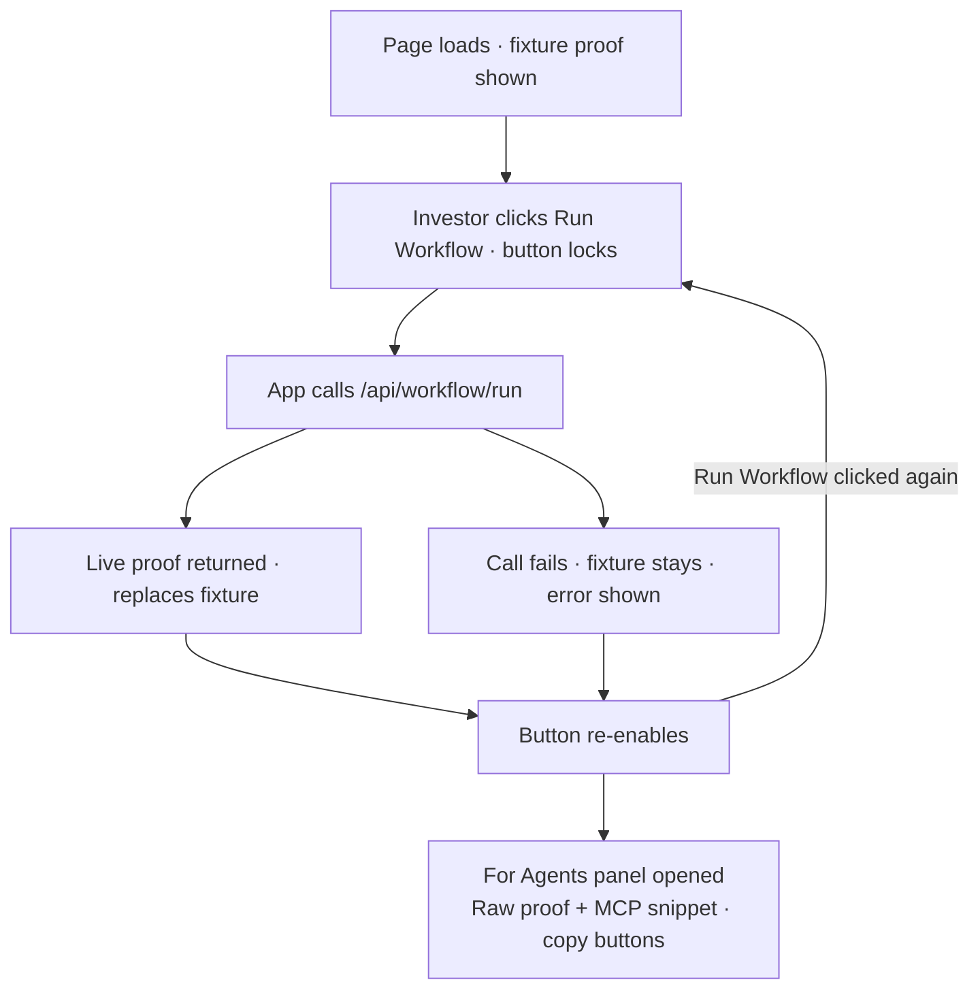

# Studio App UI Update and MCP Setup

## Overview

**What:**
An investor can trigger a real screening run from the browser, watch the live proof replace the placeholder, and hand the signed proof to an AI agent via a one-click MCP connection — without trusting Orbbit's word at any step.

**Why:**
Without this, the studio page shows only hardcoded fixture data with no way to trigger a live run or connect an agent. The core demo claim — "proof, not a promise" — cannot be demonstrated interactively. Judges see a static mockup; agents have no entry point.

**How:**
The page gains a Run Workflow button that triggers the live pipeline and swaps in the real proof on success, falling back to the fixture on error so the UI never breaks. A sidebar exposes the raw signed proof and MCP connection instructions so any agent can independently verify the result in one copy-paste.

**Zone 1 check:**
Advances the **Implementation** stage — moves the studio UI from a static mockup to a live, interactive proof surface that an investor can operate and an agent can consume independently.

---

## Core Logic



### Business rules

- While `running`, the button is disabled and cursor is `not-allowed`
- On success, `liveProof` replaces `MOCK_PROOF` for all child components simultaneously
- On error, `MOCK_PROOF` is used as fallback — the UI never renders a broken state
- The agent sidebar always reflects whichever proof (live or fixture) is currently shown on the page
- Copy button: idle → teal background + teal border + checkmark icon for 1500ms → idle
- No `Receipt`, `MOCK_RECEIPT`, or `Pipeline` terminology anywhere in the FE — all replaced with `Proof` / `MOCK_PROOF` / `Workflow`

---

## File Tree

```
.mcp.json                                           ← openpop MCP server entry added (http://localhost:3000/api/mcp)
apps/studio/src/
├── app/
│   └── page.tsx                                    ← Run Workflow button + idle/running/done/error state machine
├── types/
│   └── proof.ts                                    ← Proof type (canonical shape shared by all FE components)
├── lib/
│   └── fixtures.ts                                 ← MOCK_PROOF (replaces MOCK_RECEIPT)
└── components/
    ├── agent/
    │   ├── AgentSheet.tsx                          ← widened to 760px; hosts RawProof + McpSnippet
    │   ├── RawProof.tsx                            ← syntax-highlighted JSON display + copy button
    │   └── McpSnippet.tsx                          ← get_proof tool definition + one-liner install + copy buttons
    └── human/
        ├── AttestationBar.tsx                      ← terminology: Receipt → Proof
        ├── VerdictCard.tsx                         ← terminology: Receipt → Proof
        └── WorkflowCanvas.tsx                      ← terminology: Pipeline → Workflow, Receipt → Proof
```

---

## Action Items

**[ ] Run Workflow button and status state machine**

Implement: `apps/studio/src/app/page.tsx` — adds a `WorkflowStatus` state machine (`idle | running | done | error`) driving a Run Workflow button that POSTs to `/api/workflow/run`, sets `liveProof` on success, and falls back to `MOCK_PROOF` on error.

Verify:
```
curl -s -o /dev/null -w "%{http_code}" -X POST http://localhost:3000/api/workflow/run
```
→ `200` (or `500` if CRE not running) — page button triggers the call; status label updates to match response

---

**[ ] Proof type and terminology rename**

Implement: `apps/studio/src/types/proof.ts` and `apps/studio/src/lib/fixtures.ts` — defines the canonical `Proof` type and `MOCK_PROOF` fixture; all human-layer components (`VerdictCard`, `WorkflowCanvas`, `AttestationBar`) updated to accept `proof: Proof`.

Verify:
```
grep -r "Receipt\|MOCK_RECEIPT\|Pipeline" apps/studio/src/
```
→ empty — no stale terminology in any FE file

---

**[ ] MCP server entry**

Implement: `.mcp.json` — adds `openpop` server entry pointing at `http://localhost:3000/api/mcp` so any Claude Code session in this repo connects automatically.

Verify:
```
jq '.mcpServers.openpop.url' .mcp.json
```
→ `"https://localhost:3000/api/mcp"`

---

**[ ] Agent sidebar — RawProof and McpSnippet**

Implement: `apps/studio/src/components/agent/RawProof.tsx` and `McpSnippet.tsx` — `RawProof` renders the live proof as syntax-highlighted JSON with a copy button; `McpSnippet` shows the `get_proof` tool definition and one-liner install, each with a copy button using Orbbit teal (`hsl(180, 85%, _)`) active states. `AgentSheet.tsx` hosts both at 760px width.

Verify:
```
open http://localhost:3000 && echo "manual: click For Agents → sidebar opens at 760px; copy button turns teal on click"
```
→ sidebar renders `RAW JSON PROOF` block and MCP tool definition; copy button background transitions to `hsl(180, 85%, 8%)` on click
