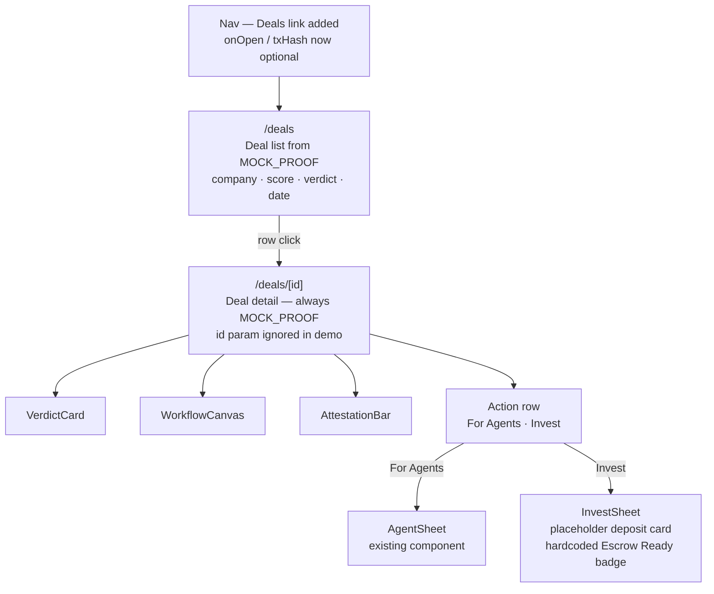

# Investor Portal UI Skeleton — Deal List, Detail, and Invest Sheet

## Overview

**What:**
Three new surfaces in the Studio app — `/deals` (deal list), `/deals/[id]` (deal detail), and `InvestSheet` (invest side sheet) — that give Aaron a place to browse verified workflows, read the proof, and initiate a deposit.

**Why:**
The existing studio is Sneehee's view: the pipeline runner and receipt display for the borrower. Aaron has no page. Without this skeleton, the investor half of the two-party demo is inaccessible — his agent can call `get_proof` via MCP but there is no human surface for him to see the deal, read the attestation, and act.

**How:**
`/deals` renders a list of screened workflows from the existing `MOCK_PROOF` fixture. `/deals/[id]` reuses `VerdictCard`, `WorkflowCanvas`, and `AttestationBar` — the same components that already exist — and adds a local action row with "For Agents" (opens `AgentSheet`) and "Invest" (opens `InvestSheet`). `InvestSheet` is a presentational side sheet with a placeholder deposit card and a hardcoded "Escrow Ready" badge. No new API calls. No Dynamic wiring yet — that is M1/02.

---

## Core Logic



- All data comes from `MOCK_PROOF` — no fetch calls in any new file
- `/deals/[id]` ignores the `id` param — one deal exists in the demo
- `Nav` `onOpen` and `txHash` become optional; their buttons conditionally render; "Deals" link added

---

## File Tree

```
apps/studio/src/
├── components/
│   ├── Nav.tsx                          ← MODIFY: optional onOpen/txHash; add Deals link
│   └── investor/
│       └── InvestSheet.tsx              ← NEW: side sheet, deposit card, Escrow Ready badge
└── app/
    └── deals/
        ├── page.tsx                     ← NEW: deal list
        └── [id]/
            └── page.tsx                 ← NEW: deal detail
```

---

## Action Items

**[x] Update `Nav` — optional props and Deals link**

Implement: Make `onOpen` and `txHash` optional in `NavProps`. Wrap the "For Agents" button in `{onOpen && ...}` and the "View on-chain" link in `{txHash && ...}`. Change logo `href` from `#` to `/`. Add a "Deals" `<a href="/deals">` link between the logo group and the right-side buttons.

Verify:
```bash
cd apps/studio && npx tsc --noEmit && echo "pass"
```
→ prints `pass`; existing `page.tsx` still compiles (it passes both props explicitly).

---

**[x] Create `apps/studio/src/app/deals/page.tsx` — deal list**

Implement: Server component. Import `MOCK_PROOF` from `@/lib/fixtures`. Render a table-style list with one row: company name, score, verdict pill (Approved/Rejected), and date formatted as `YYYY-MM-DD`. The row is an `<a href="/deals/gallivant-001">` that covers the full row. Nav rendered with no `onOpen` or `txHash` (Deals link visible, agent/chain buttons hidden).

Verify:
```bash
cd apps/studio && npx tsc --noEmit && echo "pass"
```
→ prints `pass`; `/deals` route appears in `next build` output.

---

**[x] Create `apps/studio/src/app/deals/[id]/page.tsx` — deal detail**

Implement: Client component (`'use client'`). Two pieces of `useState`: `agentOpen` and `investOpen`. Import `MOCK_PROOF` and compose `VerdictCard`, `WorkflowCanvas`, `AttestationBar` (identical layout rhythm to root `page.tsx`). Above `VerdictCard`, render an action row with two buttons: "For Agents" (sets `agentOpen(true)`) and "Invest" (sets `investOpen(true)`). Render `AgentSheet` and `InvestSheet` controlled by those flags. Nav rendered with no `onOpen` or `txHash`.

Verify:
```bash
cd apps/studio && npx tsc --noEmit && echo "pass"
```
→ prints `pass`; `/deals/[id]` route appears in `next build` output.

---

**[x] Create `apps/studio/src/components/investor/InvestSheet.tsx` — invest side sheet**

Implement: Use the existing `Sheet` / `SheetContent` primitive from `@/components/ui/sheet`. Props: `open: boolean`, `onClose: () => void`. Body contains two sections:

1. Deposit card — company name (`MOCK_PROOF.companyName`), invoice amount (`MOCK_PROOF.invoiceAmount`), a "USDC" label, and a hardcoded amount of `$50,000`.
2. Status badge — a pill reading "Escrow Ready" in teal.

No API calls. No Dynamic SDK import. Hardcoded values only.

Verify:
```bash
cd apps/studio && npx tsc --noEmit && echo "pass"
```
→ prints `pass`; `InvestSheet` renders without errors in the detail page.
