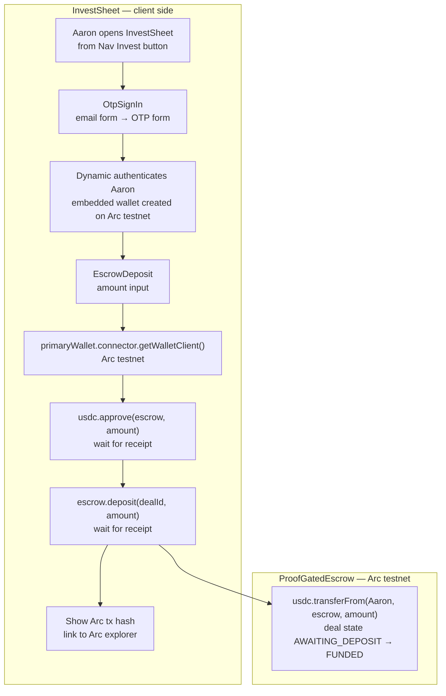

# Dynamic Embedded Wallet in InvestSheet

## Overview

**What:**
An `InvestSheet` slide-over where Aaron signs in with his email via Dynamic OTP, receives an embedded wallet on Arc testnet, enters a deposit amount, and signs `approve` + `deposit()` directly from the browser — funding the `ProofGatedEscrow` with a real Arc testnet tx.

**Why:**
Without this, the escrow must be pre-funded manually via a Hardhat script before every demo run. That makes Aaron's side a human-in-the-loop setup step, contradicting the core OpenPop story. This closes the gap: Aaron opens a panel, signs in, clicks Deposit, and the escrow is funded with no operator involvement.

**How:**
Dynamic React SDK (`@dynamic-labs/sdk-react-core` + `@dynamic-labs/ethereum`) handles OTP auth and embedded wallet creation. Arc testnet is registered as a custom EVM network via `overrides.evmNetworks` in `DynamicContextProvider`. Once authenticated, `EscrowDeposit` reads `primaryWallet` from `useDynamicContext()`, gets a viem wallet client from the connector, and calls `writeContract` for `usdc.approve(escrow, amount)` then `escrow.deposit(dealId, amount)` in sequence. The Arc tx hash is displayed on completion.

**Zone 1 check:**
The investor deposit step is currently Zone 2 — a human must run a Hardhat setup script to fund the escrow before the demo. This makes it Zone 1: Aaron deposits through the UI with his own embedded wallet, and the escrow is funded automatically with no script or operator in the critical path.

---

## Core Logic



**Business rules:**

- `DynamicContextProvider` must wrap the entire app — `layout.tsx` is a Next.js Server Component so it wraps `{children}` via a `'use client'` `DynamicProvider` component
- Arc testnet (`chainId: 5042002`) must be registered via `overrides.evmNetworks` — it is not in Dynamic's default network list
- `InvestSheet` renders `OtpSignIn` when `useDynamicContext().user` is null, `EscrowDeposit` when user is set
- `OtpSignIn` is two steps only: email → `connectWithEmail(email)` → OTP → `verifyOneTimePassword(otp)` via `useConnectWithOtp()`. Dynamic OTP is sign-up and sign-in in one flow — new users get an account and embedded wallet created automatically on first OTP verify; returning users get their existing wallet restored. No separate registration step exists.
- `EscrowDeposit` calls `approve` and waits for the receipt before calling `deposit()` — never fire both in parallel
- `NEXT_PUBLIC_DEAL_ID` is hardcoded `2` — deal #1 is the M0 demo deal (already RELEASED), deal #2 is the M1 target
- Aaron's embedded wallet must be pre-funded with USDC on Arc testnet before the demo — this is a one-time manual step, not part of this spec
- Server wallet (`lib/wallet.ts`) is unchanged — it handles x402 dairy price payment only, not the escrow deposit

---

## File Tree

```
apps/studio/
├── src/
│   ├── app/
│   │   ├── layout.tsx                        ← add <DynamicProvider> around {children}
│   │   └── page.tsx                          ← add investSheetOpen state + <InvestSheet>
│   └── components/
│       ├── Nav.tsx                           ← add onInvest prop + "Invest" button
│       ├── DynamicProvider.tsx               ← 'use client' wrapper; Arc testnet config
│       └── invest/
│           ├── InvestSheet.tsx               ← Sheet wrapper; OtpSignIn or EscrowDeposit
│           ├── OtpSignIn.tsx                 ← email → OTP two-step form
│           └── EscrowDeposit.tsx             ← amount input + approve + deposit() + tx hash
└── .env.example                              ← add NEXT_PUBLIC_ keys
```

---

## Action Items

**[x] Install Dynamic React SDK packages**

Implement: In `apps/studio`, install `@dynamic-labs/sdk-react-core @dynamic-labs/ethereum`.

Verify:
```bash
cd apps/studio && node -e "require('@dynamic-labs/sdk-react-core')"
```
→ exits 0

---

**[x] Create `apps/studio/src/components/DynamicProvider.tsx`**

Implement: `'use client'` component that wraps `children` in `DynamicContextProvider` with `EthereumWalletConnectors`, `environmentId` from `process.env.NEXT_PUBLIC_DYNAMIC_ENVIRONMENT_ID`, and Arc testnet registered via `overrides.evmNetworks`:
```ts
{
  blockExplorerUrls: ['https://explorer.arc.net'],
  chainId: 5042002,
  chainName: 'Arc Testnet',
  iconUrls: ['https://app.dynamic.xyz/assets/networks/eth.svg'],
  name: 'Arc Testnet',
  nativeCurrency: { decimals: 18, name: 'ETH', symbol: 'ETH' },
  networkId: 5042002,
  rpcUrls: [process.env.NEXT_PUBLIC_ARC_RPC_URL ?? 'https://rpc.testnet.arc.network'],
}
```
Add `NEXT_PUBLIC_DYNAMIC_ENVIRONMENT_ID=your-environment-id` and `NEXT_PUBLIC_ARC_RPC_URL=https://rpc.testnet.arc.network` to `apps/studio/.env.example`.

Verify:
```bash
cd apps/studio && npx tsc --noEmit
```
→ exits 0

---

**[x] Update `apps/studio/src/app/layout.tsx`**

Implement: Import `DynamicProvider` and wrap `{children}` with it inside `<body>`.

Verify:
```bash
cd apps/studio && npx tsc --noEmit
```
→ exits 0

---

**[x] Create `apps/studio/src/components/invest/OtpSignIn.tsx`**

Implement: `'use client'` component. Local state: `email`, `otp`, `otpSent: boolean`, `loading: boolean`, `error: string | null`. Step 1 — email form: on submit, call `connectWithEmail(email)` from `useConnectWithOtp()`, set `otpSent = true`. Step 2 — OTP form: on submit, call `verifyOneTimePassword(otp)`. Matches existing dark UI style (`var(--surface)`, `var(--teal)`).

Verify:
```bash
cd apps/studio && npx tsc --noEmit
```
→ exits 0

---

**[x] Create `apps/studio/src/components/invest/EscrowDeposit.tsx`**

Implement: `'use client'` component. Local state: `amount: string`, `status: 'idle' | 'approving' | 'depositing' | 'done' | 'error'`, `txHash: string | null`. On submit:
1. `walletClient = await primaryWallet.connector.getWalletClient()` (cast connector to `EthereumWalletConnector` from `@dynamic-labs/ethereum`)
2. `await walletClient.writeContract({ address: USDC_ADDRESS, abi: ERC20_APPROVE_ABI, functionName: 'approve', args: [ESCROW_ADDRESS, amountBigInt] })` — set status `'approving'`, wait for receipt
3. `await walletClient.writeContract({ address: ESCROW_ADDRESS, abi: DEPOSIT_ABI, functionName: 'deposit', args: [BigInt(DEAL_ID), amountBigInt] })` — set status `'depositing'`, wait for receipt, capture `txHash`
4. Set status `'done'`, render tx hash as Arc explorer link

`USDC_ADDRESS`, `ESCROW_ADDRESS`, `DEAL_ID` read from `process.env.NEXT_PUBLIC_USDC_ADDRESS`, `process.env.NEXT_PUBLIC_PROOF_GATED_ESCROW_ADDRESS`, `process.env.NEXT_PUBLIC_DEAL_ID`. Add these to `apps/studio/.env.example`.

Verify:
```bash
cd apps/studio && npx tsc --noEmit
```
→ exits 0

---

**[x] Create `apps/studio/src/components/invest/InvestSheet.tsx`**

Implement: `'use client'` component. Reuses `Sheet` / `SheetContent` from `@/components/ui/sheet` (same pattern as `AgentSheet`). Reads `user` from `useDynamicContext()`. Renders `<OtpSignIn />` when `!user`, `<EscrowDeposit />` when `user` is set. Props: `open: boolean`, `onClose: () => void`.

Verify:
```bash
cd apps/studio && npx tsc --noEmit
```
→ exits 0

---

**[x] Update `apps/studio/src/components/Nav.tsx`**

Implement: Add optional `onInvest?: () => void` prop. Add an "Invest" button to the right-side nav group (same style as "For Agents" button) that calls `onInvest?.()`.

Verify:
```bash
cd apps/studio && npx tsc --noEmit
```
→ exits 0

---

**[x] Update `apps/studio/src/app/page.tsx`**

Implement: Add `investSheetOpen` state (`useState<boolean>(false)`). Pass `onInvest={() => setInvestSheetOpen(true)}` to `<Nav>`. Render `<InvestSheet open={investSheetOpen} onClose={() => setInvestSheetOpen(false)} />` alongside `<AgentSheet>`.

Verify:
```bash
cd apps/studio && npx tsc --noEmit
```
→ exits 0
