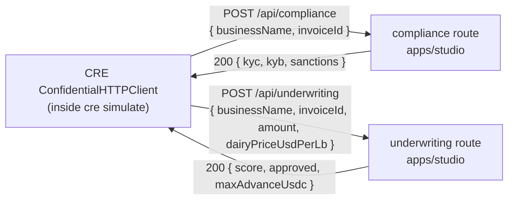

# Move offchain services into studio

## Overview

**What:**
The studio app exposes two new endpoints — compliance check and underwriting decision — so that the CRE verification workflow can call them directly during simulation. No separate mock service needs to be launched alongside the app.

**Why:**
Running the full CRE verification workflow currently requires two terminal processes to be alive at the same time: the studio app and a standalone mock server on a different port. If the mock server is not running, the workflow silently fails mid-simulation. This fragility makes the demo unreliable and forces every developer to remember a two-step startup.

**How:**
The two mock service responses are promoted from a standalone process into the studio app itself, served from the same process and port as the rest of the BFF layer. The workflow config is updated to point at the studio's local address.

**Zone 1 check:**
Advances **Implementation** toward Zone 1. The verify criterion is binary: `cre simulate --broadcast` either reaches the compliance and underwriting endpoints and completes, or it does not. No human judgement required to confirm the outcome.

---

## Core Logic



### Business rules

- Both routes always return 200 — no auth validation, no body parsing, no conditional logic
- Response shapes are fixed fixtures; they never vary based on request content
- The Authorization header sent by CRE's ConfidentialHTTPClient is accepted and ignored
- `config.staging.json` must reference `http://localhost:3000/api/...` — not port 8787

---

## File Tree

```
apps/studio/src/app/api/
├── compliance/
│   └── route.ts              ← POST handler returning compliance fixture
└── underwriting/
    └── route.ts              ← POST handler returning underwriting fixture

apps/studio/__tests__/api/
├── compliance/
│   └── route.test.ts         ← verifies 200 + shape of compliance response
└── underwriting/
    └── route.test.ts         ← verifies 200 + shape of underwriting response

cre/loan/
└── config.staging.json       ← complianceApiUrl + underwritingApiUrl → localhost:3000
```

---

## Action Items

**[x] Add `POST /api/compliance` route and test**

Implement: Create `apps/studio/src/app/api/compliance/route.ts` returning `{ kyc: "pass", kyb: "pass", sanctions: "clear" }` with status 200, and `apps/studio/__tests__/api/compliance/route.test.ts` verifying the response shape.

Verify:
```bash
cd apps/studio && npx vitest run __tests__/api/compliance/route.test.ts
```
→ exits 0, 1 test passed

---

**[x] Add `POST /api/underwriting` route and test**

Implement: Create `apps/studio/src/app/api/underwriting/route.ts` returning `{ score: 82, approved: true, maxAdvanceUsdc: 40000 }` with status 200, and `apps/studio/__tests__/api/underwriting/route.test.ts` verifying the response shape.

Verify:
```bash
cd apps/studio && npx vitest run __tests__/api/underwriting/route.test.ts
```
→ exits 0, 1 test passed

---

**[x] Update CRE config URLs to point at studio**

Implement: Update `cre/loan/config.staging.json` — set `complianceApiUrl` to `http://localhost:3000/api/compliance` and `underwritingApiUrl` to `http://localhost:3000/api/underwriting`.

Verify:
```bash
grep 'localhost:3000' cre/loan/config.staging.json | wc -l | tr -d ' '
```
→ `2`
