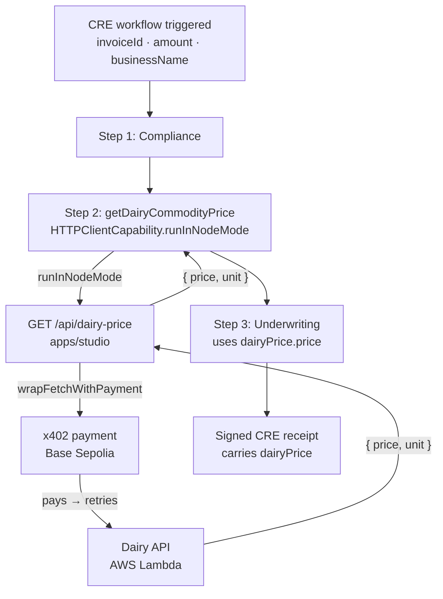

# Wire up dairy price proxy in Next.js and update CRE workflow to call it

## Overview

**What:**
The pipeline now produces a verified commodity price — the dairy cream spot price is fetched as part of the screened workflow, not handed to it before it starts. Investors reading the proof see a price the system paid for and obtained during execution.

**Why:**
Today the dairy price is fetched before the workflow runs and injected into the trigger payload. That means the price acquisition happens outside the verifiable pipeline — an investor reading the proof cannot know whether the workflow actually acquired the price or simply accepted whatever number it was handed. The proof should carry a price the workflow obtained itself.

**How:**
Add a lightweight price endpoint to the studio server. The CRE workflow calls that endpoint during execution so the price acquisition is part of the pipeline run, not a prerequisite that happens before it.

**Zone 1 check:**
Advances the Underwriting execution stage toward Zone 1. The underwriting step uses the dairy commodity price as a key input; if that price is obtained outside the verifiable pipeline, the proof carries an unverified number. Wiring the fetch inside CRE means the signed receipt covers a price the workflow itself paid for.

---

## Core Logic



### Business rules

- The proxy must return `{ price: number, unit: string }` — CRE treats any non-2xx or missing field as a workflow error; no fallback to mock
- `runInNodeMode` runs the fetch closure on each node independently — price is aggregated by `median` across nodes; `unit` must be `identical`
- `workflow/run/route.ts` no longer passes `dairyPriceUsdPerLb` in the trigger payload — the workflow fetches the price itself
- The x402 payment uses `DYNAMIC_WALLET_PASSWORD` (Base Sepolia EOA) — same credential already used by `workflow/run/route.ts`, now owned by the proxy route

---

## File Tree

```
apps/studio/src/app/api/
  dairy-price/
    route.ts              ← NEW: GET handler — x402 payment → DAIRY_PRICING_API_URL → { price, unit }
  workflow/run/
    route.ts              ← MODIFIED: remove dairy fetch, wrapFetchWithPayment, dairyPriceUsdPerLb injection

cre/invoice-financing/
  types.ts                ← MODIFIED: add dairyPriceApiUrl: string to Config
  config.staging.json     ← MODIFIED: add "dairyPriceApiUrl": "http://localhost:3000/api/dairy-price"
  steps/
    dairy-commodity-price.ts  ← MODIFIED: replace req.dairyPriceUsdPerLb read with HTTPClientCapability.runInNodeMode
```

---

## Action Items

**[x] Unit test for `/api/dairy-price` route**

Implement: Create `apps/studio/__tests__/api/dairy-price/route.test.ts` — mock `wrapFetchWithPayment` and `fetch`; assert GET returns `{ price: number, unit: string }` on success and 500 on fetch failure.

Verify:
```
cd apps/studio && npx vitest run __tests__/api/dairy-price/route.test.ts
```
→ exits 0, all tests pass

---

**[x] Add `/api/dairy-price` GET route to studio**

Implement: Create `apps/studio/src/app/api/dairy-price/route.ts` — GET handler that builds a viem wallet client from `DYNAMIC_WALLET_PASSWORD` on Base Sepolia, wraps fetch with x402 payment, calls `DAIRY_PRICING_API_URL`, and returns `{ price, unit }`.

Verify:
```
grep -n "wrapFetchWithPayment\|DAIRY_PRICING_API_URL" apps/studio/src/app/api/dairy-price/route.ts
```
→ exits 0, prints lines containing both identifiers

---

**[x] Add `dairyPriceApiUrl` to CRE Config type**

Implement: Update `cre/invoice-financing/types.ts` to add `dairyPriceApiUrl: string` to the `Config` type.

Verify:
```
grep "dairyPriceApiUrl" cre/invoice-financing/types.ts
```
→ prints `dairyPriceApiUrl: string`

---

**[x] Add `dairyPriceApiUrl` to CRE staging config**

Implement: Update `cre/invoice-financing/config.staging.json` to add `"dairyPriceApiUrl": "http://localhost:3000/api/dairy-price"`.

Verify:
```
jq '.dairyPriceApiUrl' cre/invoice-financing/config.staging.json
```
→ prints `"http://localhost:3000/api/dairy-price"`

---

**[x] Update `getDairyCommodityPrice` to call proxy via `runInNodeMode`**

Implement: Rewrite `cre/invoice-financing/steps/dairy-commodity-price.ts` to use `HTTPClientCapability.runInNodeMode` — fetch closure calls `runtime.config.dairyPriceApiUrl`, aggregates `price` by median and `unit` by identical; remove `req` parameter dependency.

Verify:
```
grep -n "runInNodeMode\|dairyPriceApiUrl" cre/invoice-financing/steps/dairy-commodity-price.ts
```
→ prints at least two lines, one containing each identifier

---

**[x] Remove dairy fetch from `workflow/run/route.ts`**

Implement: Update `apps/studio/src/app/api/workflow/run/route.ts` to remove the viem wallet client setup, `wrapFetchWithPayment` call, and `dairyPriceUsdPerLb` field from the trigger payload object.

Verify:
```
grep -n "DYNAMIC_WALLET_PASSWORD\|dairyPriceUsdPerLb\|wrapFetchWithPayment" apps/studio/src/app/api/workflow/run/route.ts
```
→ exits 0 with empty output
