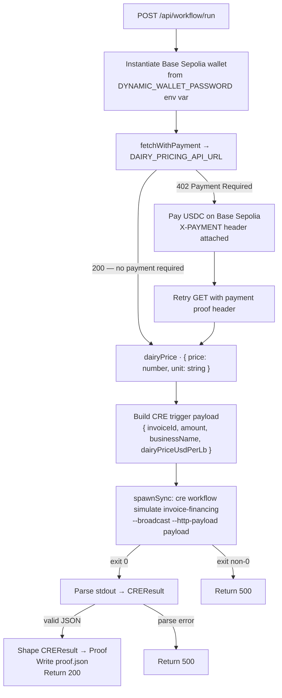

# Wire x402 Dairy Price Fetch into CRE Simulation

## Overview

**What:**
The OpenPop verification pipeline fetches a live dairy price and pays for it on-chain before the workflow runs — so the signed proof carries a commodity price that any counterparty can independently verify was paid for, not fabricated.

**Why:**
The proof currently carries a hardcoded placeholder price. Any investor or judge can see the number never changes, which undermines the core OpenPop claim: that the proof reflects real-world inputs. A static number is indistinguishable from an operator's assertion — exactly the trust problem OpenPop is supposed to solve.

**How:**
Before firing the CRE verification workflow, the system pays for access to a live dairy price through a payment-gated market data endpoint. The price is paid for on-chain using a dedicated server wallet and injected into the workflow input, so the resulting signed receipt carries a commodity price backed by a real payment transaction.

**Zone 1 check:**
Advances **Underwriting** toward Zone 1. The underwriting score is currently computed from a fixed price input (`2.13`), making it impossible for a counterparty to verify that the score reflects current market conditions. With a live dairy price backed by an on-chain payment receipt, the underwriting input becomes independently verifiable — a counterparty can check the payment tx and the price it unlocked.

---

## Core Logic



### Business rules

- `dairyPriceUsdPerLb` must be present in the CRE trigger payload — the handler must not be allowed to fall back to the mock config value when the route is invoked.
- If the dairy price fetch fails for any reason (network error, non-2xx after payment), the route returns 500 and does not call `spawnSync`.
- The x402 wallet is Base Sepolia only — it is never used for Arc Testnet transactions.
- The proof written to `proof.json` must carry the price returned by the live API, not the mock value.

---

## File Tree

```
apps/studio/
  package.json                                    ← add x402-fetch and viem to dependencies
  src/app/api/workflow/run/
    route.ts                                      ← fetch live dairy price via x402 before spawnSync; inject into payload
  __tests__/api/workflow/run/
    route.test.ts                                 ← mock x402-fetch; stub DYNAMIC_WALLET_PASSWORD so existing tests pass
.env.example                                      ← add DAIRY_PRICING_API_URL and DYNAMIC_WALLET_PASSWORD
specs/m2-x402/03-integration/
  TECH-187-wire-x402-dairy-price-fetch-into-cre-simulation/
    spec.md                                       ← this file
```

---

## Action Items

**[x] Add x402-fetch and viem to studio dependencies**

Implement: Add `"x402-fetch": "latest"` and `"viem": "^2.0.0"` to the `dependencies` block in `apps/studio/package.json`, then run `npm install` from `apps/studio/`.

Verify:
```bash
grep '"x402-fetch"' apps/studio/package.json && grep '"viem"' apps/studio/package.json
```
→ both lines print, exits 0

---

**[x] Fetch live dairy price via x402 in /api/workflow/run**

Implement: Update `apps/studio/src/app/api/workflow/run/route.ts` — before `spawnSync`, create a Base Sepolia wallet client from `process.env.DYNAMIC_WALLET_PASSWORD`, wrap `fetch` with payment capability, call `process.env.DAIRY_PRICING_API_URL`, and add `dairyPriceUsdPerLb: dairyPrice.price` to the trigger payload. If the fetch throws or the response is not ok, return 500 before calling `spawnSync`.

Verify:
```bash
grep -q 'wrapFetchWithPayment' apps/studio/src/app/api/workflow/run/route.ts && \
grep -q 'dairyPriceUsdPerLb' apps/studio/src/app/api/workflow/run/route.ts
```
→ exits 0

---

**[x] Update workflow/run tests to mock x402-fetch**

Implement: Update `apps/studio/__tests__/api/workflow/run/route.test.ts` — add `vi.mock('x402-fetch', ...)` returning a `wrapFetchWithPayment` stub that resolves `{ price: 2.34, unit: 'USD/lb' }`, and set `process.env.DYNAMIC_WALLET_PASSWORD` to a valid-format test private key so wallet instantiation does not throw. All existing test assertions must continue to pass.

Verify:
```bash
cd apps/studio && npm test
```
→ exits 0, all tests pass

---

**[x] Document DAIRY_PRICING_API_URL and DYNAMIC_WALLET_PASSWORD in .env.example**

Implement: In `.env.example`, update `DAIRY_PRICING_API_URL` to `https://g78md4c7ke.execute-api.us-east-1.amazonaws.com/dairy/cream/price` and add `DYNAMIC_WALLET_PASSWORD=your-base-sepolia-eoa-private-key` under a new `── x402 payment wallet (Base Sepolia) ──` section with a comment explaining this EOA must hold testnet USDC to pay for dairy price API queries.

Verify:
```bash
grep 'g78md4c7ke' .env.example && grep 'DYNAMIC_WALLET_PASSWORD' .env.example
```
→ both lines print, exits 0
