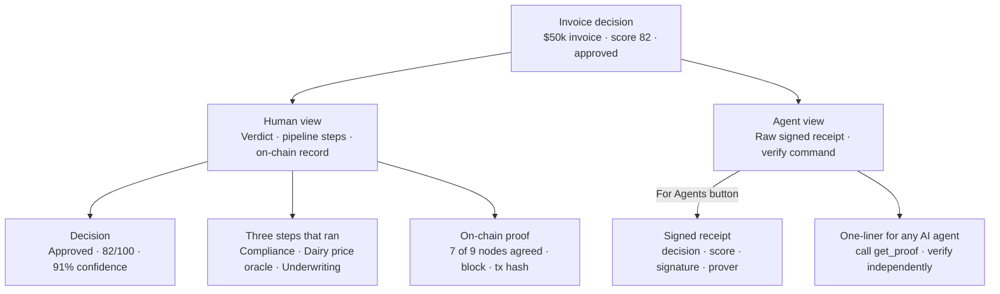

# Scaffold Next.js UI Shell

## Overview

**What:**
A demo page built for one audience — the investor — showing the same underlying decision two ways at once: as a human reading a verdict, and as an AI agent reading the cryptographic proof that backs it. Neither view requires trusting Orbbit's word.

**Why:**
Right now the OpenPop story only exists in documents. Judges and investors cannot see it, interact with it, or screenshot it. Every other piece of build work — the compliance check, the oracle, the escrow contract — produces invisible output until there is a page to show it on. This is the page.

**How:**
A single screen shows the investor the invoice verdict: approved, score, confidence, the three steps that ran, and the on-chain record. A "For Agents" button opens a dark panel showing the raw signed receipt and a one-liner for any AI agent to call and verify the proof independently. Both sides read the same underlying data. All values are pre-filled with realistic demo data — no live systems needed to make the page work.

**Zone 1 check:**
Implementation stage. One page, one audience, fully static — build cost and verify cost are both bounded (`npm run build` exits 0 + visual browser check). Zero unknowns.

---

## Core Logic



- Always: both views read the same underlying decision — the proof is what backs the verdict
- Never: either view fetches live data — the demo story is pre-filled and works without any backend

---

## File Tree

```
apps/demo-ui/
├── package.json                  ← Next.js 14 + Tailwind + @xyflow/react, standalone
├── tailwind.config.ts            ← maps design tokens to Tailwind utilities
├── components.json               ← shadcn config
├── tsconfig.json
├── next.config.ts
└── src/
    ├── app/
    │   ├── layout.tsx            ← root layout, imports globals.css
    │   ├── globals.css           ← design tokens (primary teal, slate base, radius, dark mode)
    │   └── page.tsx              ← root page: sheetOpen state + all components wired to fixture
    ├── types/
    │   └── receipt.ts            ← Receipt type
    ├── lib/
    │   ├── utils.ts              ← cn() utility (clsx + tailwind-merge)
    │   └── fixtures.ts           ← hardcoded mock receipt: demo invoice story
    └── components/
        ├── Nav.tsx               ← shared shell: OpenPop logo, proof ID badge, For Agents button
        ├── human/
        │   ├── VerdictCard.tsx   ← decision badge, credit score, confidence level
        │   ├── WorkflowCanvas.tsx← pipeline graph: 3 CRE steps + Decision Recorded
        │   ├── ProofNode.tsx     ← custom graph node (icon, label, metadata)
        │   └── AttestationBar.tsx← prover identity, consensus ratio, block number, tx hash
        └── agent/
            ├── AgentSheet.tsx    ← shadcn Sheet: dark slide-in panel
            ├── RawReceipt.tsx    ← signed receipt JSON display
            └── McpSnippet.tsx    ← get_proof tool definition + install one-liner
```

---

## Action Items

**[ ] Scaffold Next.js app with Tailwind and shadcn**

Implement: Create `apps/demo-ui/` as a standalone Next.js 14 app with TypeScript, App Router, and Tailwind enabled, then initialise shadcn and install `@xyflow/react`.

Verify:
```bash
grep -q "@xyflow/react" apps/demo-ui/package.json && \
grep -q "shadcn" apps/demo-ui/package.json && \
echo "pass"
```
→ prints `pass`

---

**[ ] Wire design tokens**

Implement: Define `src/app/globals.css` with the full CSS variable system — primary teal `hsl(180, 85%, 32%)`, slate base colors, radius tokens, dark mode variables — and configure `tailwind.config.ts` to map those variables to Tailwind utilities.

Verify:
```bash
cd apps/demo-ui && npm run build && echo "pass"
```
→ prints `pass`

---

**[ ] Create Receipt type and mock fixture**

Implement: Create `src/types/receipt.ts` defining the `Receipt` type and `src/lib/fixtures.ts` exporting a hardcoded mock receipt (score 82, compliant, approved, three CRE step labels, simulated CRE signature and Arc testnet tx hash).

Verify:
```bash
cd apps/demo-ui && npx tsc --noEmit && echo "pass"
```
→ prints `pass`, no type errors

---

**[ ] Human-view components**

Implement: Build `Nav.tsx` (OpenPop logo, proof ID badge, For Agents button), `human/VerdictCard.tsx` (decision badge, score, confidence), `human/WorkflowCanvas.tsx` + `human/ProofNode.tsx` (pipeline graph: Compliance → Dairy Price Oracle → Underwriting → Decision Recorded), and `human/AttestationBar.tsx` (prover identity, 7/9 consensus, block number, tx hash).

Verify:
```bash
cd apps/demo-ui && npm run build && echo "pass"
```
→ prints `pass`, no TypeScript errors

---

**[ ] Agent-view components**

Implement: Build `agent/AgentSheet.tsx` using the shadcn Sheet component (dark panel, opens on For Agents button click), `agent/RawReceipt.tsx` (renders the signed receipt fixture as formatted JSON), and `agent/McpSnippet.tsx` (shows the `get_proof` tool definition and `openpop-mcp` install one-liner).

Verify:
```bash
cd apps/demo-ui && npm run build && echo "pass"
```
→ prints `pass`, no TypeScript errors

---

**[ ] Wire root page**

Implement: Update `src/app/page.tsx` to import the fixture and compose all components with `sheetOpen` boolean state driving AgentSheet open/close.

Verify:
```bash
cd apps/demo-ui && npm run build && echo "pass"
```
→ prints `pass`, build output lists `/` route
