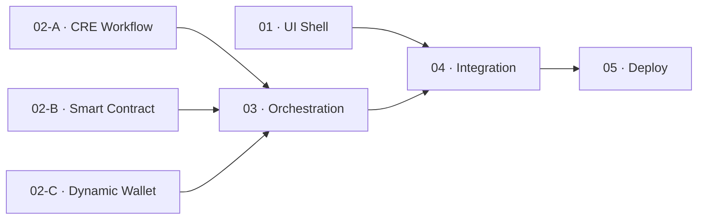

# OpenPop — Phases

**Principle:** UI first, backend in parallel, deploy pre-computed data. UI shell is demoable on day 1. Backend layers run in parallel worktrees. No SDK extraction — ship working code, not abstractions.

**Layers:** L0 = minimum viable demo · L1 = Dynamic Flow investor deposit · L2 = Confidential AI Attester (booth credentials only)

Each scope carries its own `spec.md` and `test.md`.

---

## Implementation Plan



**Parallel:** `01`, `02-A`, `02-B`, `02-C` all branch from `main` — four worktrees running simultaneously. Each scaffolds its own directory on first commit.
**Sequential:** `03 · Orchestration` needs all three sponsor tech layers done; `04 · Integration` wires the UI shell to the live receipt; `05` ships.

| Layer | Phases included |
|---|---|
| **L0** | 01 + 02-A + 02-B + 02-C → 03 → 04 → 05 |
| **L1** | Add Dynamic Flow widget to `02-C` (only after L0 deployed) |
| **L2** | Swap underwriting in `02-A` for real Confidential AI Attester call (booth credentials only) |

---

## 01 · UI Shell `[parallel worktree A — start first]`

Static Next.js demo. Hardcoded mock receipt — zero real backend. Demoable on day 1. This is what judges see first. Build this before anything else has API data. Scaffolds `apps/demo-ui/` and `.env.example` — no shared setup step needed.

```
apps/demo-ui/src/
├── app/
│   ├── page.tsx           ← OpenPop studio: 3-step pipeline + receipt + agent verdict
│   └── invest/page.tsx    ← Investor panel: deposit status + receipt viewer + Arc tx link
└── components/
    ├── PipelineSteps.tsx  ← 3 steps (compliance / dairy price / underwriting) with status badges
    ├── ReceiptCard.tsx    ← signed receipt JSON display + Arc tx link
    ├── AgentVerdict.tsx   ← get_proof output panel (hardcoded for now)
    └── McpSnippet.tsx     ← static get_proof tool definition + install instructions
```

**Also creates:**
```
apps/demo-ui/src/types/receipt.ts   ← Receipt type (shared via copy-paste into cre/ when needed)
apps/demo-ui/src/lib/fixtures.ts    ← hardcoded mock receipt for static render
.env.example                        ← Arc RPC, Dynamic API key, dairy API key, CRE target
```

**Done when:** `npm run dev` opens in browser; both pages render with hardcoded data; no console errors. Screenshot-worthy on day 1.

---

## 02-A · CRE Workflow `[parallel worktree B — Sponsor Tech]`

One Chainlink CRE workflow. Three sequential steps — compliance (mocked), dairy price fetch via x402, underwriting (mocked). One signed receipt out via `--broadcast`.

```
cre/
├── workflow.ts         ← handler: compliance → x402 dairy price → underwriting
├── config.json         ← dairyApiUrl, scoreThreshold: 650
├── secrets.yaml        ← DYNAMIC_PRIVATE_KEY ref
├── project.yaml
└── workflow.yaml
```

**Step details:**
```
Step 1 — Compliance
  input: mock identity.json + financials.json
  logic: hardcoded pass → { compliant: true }

Step 2 — Dairy price fetch
  client: HTTPClientCapability (or ConfidentialHTTPClient for L2)
  payment: Dynamic server wallet pays x402 to Orbbit dairy API
  output: { price: number, forecast: string }

Step 3 — Underwriting
  input: financials + dairy price from Step 2
  logic: mocked → { approved: true, score: 82 }
  L2 upgrade: swap for ConfidentialHTTPClient LLM call
```

**Done when:**
```bash
cre workflow simulate --broadcast --target staging-settings
# → proof.json written: { compliant, score, approved, dairyPrice, txHash, signature }
# → Arc testnet tx ID confirmed on explorer
```

---

## 02-B · Smart Contract `[parallel worktree C — Sponsor Tech]`

Arc escrow contract. Holds USDC, verifies CRE receipt via MockKeystoneForwarder, releases or locks.

```
contracts/
├── ProofGatedEscrow.sol
│   ├── depositUSDC()           ← investor deposits; funds locked
│   ├── submitProof(receipt)    ← called by Dynamic server wallet
│   ├── _verifySignature()      ← verifies against MockKeystoneForwarder (L0) or real forwarder (L2)
│   ├── _checkPolicy()          ← compliant === true AND score ≥ 650
│   ├── _release()              ← USDC → SMB's address
│   └── _lock()                 ← funds stay locked; reason code on-chain
├── MockKeystoneForwarder.sol   ← accepts locally-signed receipts (deployed by --broadcast)
└── hardhat.config.ts           ← Arc testnet RPC + deployer wallet
```

**Foundry tests (write before implementing):**
- valid receipt + score ≥ 650 → releases USDC
- valid receipt + score < 650 → locks funds
- invalid signature → reverts

**Done when:**
```bash
npx hardhat deploy --network arc-testnet
# ProofGatedEscrow deployed, status: "awaiting_proof"
# Foundry tests pass
```

---

## 02-C · Dynamic Wallet `[parallel worktree D — Sponsor Tech]`

Server wallet that signs `submitProof()` and x402 payment. L1 adds Flow widget for investor deposit.

```
apps/demo-ui/src/lib/
└── wallet.ts
    ├── serverWallet()   ← Dynamic Node SDK: signs submitProof() + x402 payment
    └── flowConfig()     ← [L1 only] Dynamic Flow: investor USDC deposit into Arc escrow
```

**Done when:** server wallet signs a test tx to the deployed contract address from `02-B`; x402 payment to dairy API succeeds.

**L1 addition:** Flow widget renders on `/invest` page; investor deposit appears in Arc escrow balance.

---

## 03 · Orchestration `[sequential — needs 02-A + 02-B + 02-C]`

Backend-only. Connect the three sponsor tech layers, run the full pipeline once, write `proof.json`. No UI involved.

```
scripts/
└── run.ts    ← cre simulate --broadcast → proof.json written
              ← Dynamic server wallet calls submitProof(receipt)
              ← Arc contract releases USDC
              ← proof.json contains txHash + all step outputs
```

**State store:** `proof.json` flat file — written once by this script, read by everything else. No database.

**Done when:**
```bash
pnpm run pipeline
# → proof.json written with real signature + txHash
# → Arc contract status → "funded"
# → USDC in SMB's wallet
```

---

## 04 · Integration `[sequential — wires 01 UI shell to 03 live data]`

UI-only. Swap every hardcoded fixture in the shell components for live reads from `proof.json`. This is where the demo becomes live.

- `PipelineSteps` reads step timestamps from `proof.json` via `/api/receipt`
- `ReceiptCard` renders real CRE receipt + real Arc tx link
- `AgentVerdict` calls `/api/mcp` (get_proof) and displays real verdict
- `/invest` page shows real escrow balance read live from Arc contract

**Done when:** trigger `pnpm run pipeline` → UI reflects real receipt data without page refresh; receipt in AgentVerdict matches on-chain state.

---

## 05 · Deploy

Everything that must be live for judges to interact.

| What | Where | How |
|---|---|---|
| `ProofGatedEscrow.sol` | Arc testnet | already deployed in `02-B` |
| `cre simulate --broadcast` | Local (pre-run) | run once, commit `proof.json` |
| `demo-ui` + API routes + MCP server | Vercel | `vercel --prod` |
| Dairy cream price API | AWS Lambda (already live) | no change needed |

**Public routes judges hit:**
```
/              → OpenPop studio (pipeline + receipt + agent verdict)
/invest        → Investor panel (deposit status + receipt + Arc tx link)
/api/receipt   → returns proof.json
/api/mcp       → get_proof MCP endpoint
```

**Done when:**
- Public URL loads both pages with real pre-computed receipt data
- Arc tx link opens on explorer and shows real on-chain tx
- Claude Code connects to `/api/mcp`, calls `get_proof`, returns signed receipt
- Video recorded showing full flow

---

## L1 — Dynamic Flow `[only after L0 deployed]`

Add investor deposit flow. One additional widget on `/invest`. One webhook endpoint.

- Dynamic Flow widget renders on `/invest` — investor deposits from any wallet/chain
- Webhook `/api/flow-webhook` receives deposit confirmation → updates UI status
- Escrow balance reads live from Arc contract

**Done when:** investor deposits USDC via Flow widget on the public URL; escrow balance updates.

---

## L2 — Confidential AI Attester `[booth credentials only]`

Swap mocked underwriting (Step 3 in `02-A`) for a real `ConfidentialHTTPClient` LLM call. One-line change.

```ts
// before (mocked)
return { approved: true, score: 82 }

// after (real)
const result = confClient.sendRequest(runtime, (req) => {
  return req.sendRequest({
    request: { url: LLM_API, method: 'POST', bodyString: JSON.stringify(prompt) },
    vaultDonSecrets: [{ key: 'LLM_API_KEY', owner: OWNER_ADDRESS }],
  }).result()
}, aggregation).result()
```

Re-run `cre simulate --broadcast` → new `proof.json` → commit → redeploy. Nothing else changes.

**Done when:** proof.json contains real LLM attestation metadata; UI labels Step 3 as "Confidential AI Attester".
